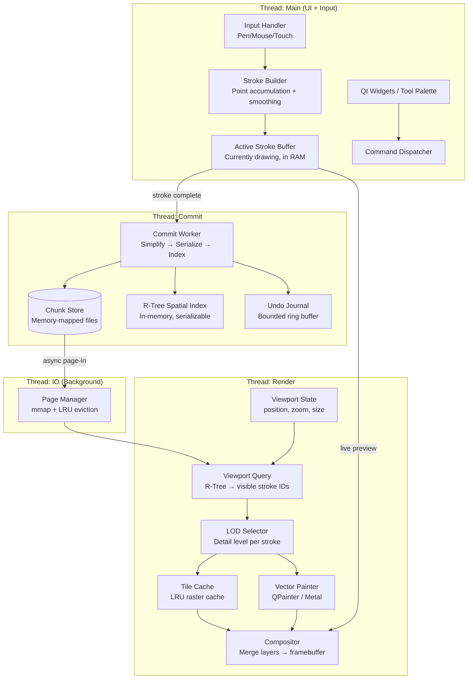
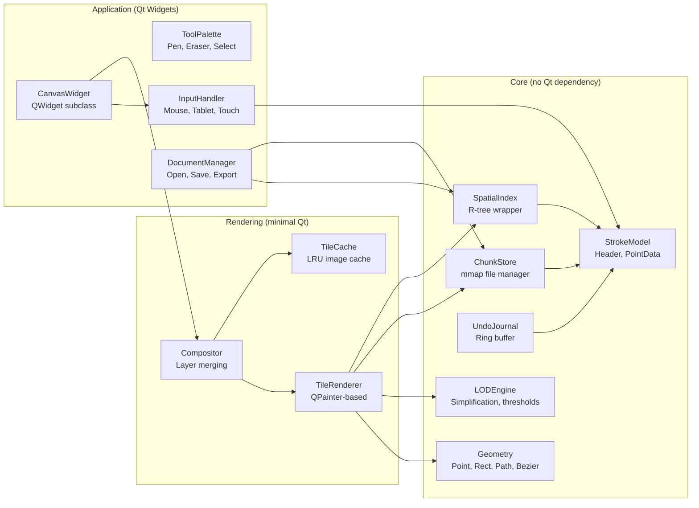

# 🏗️ InfiniteCanvas Engine — Clean-Room Architecture for Multi-Billion Stroke Performance

> **Design Principle**: The CPU must be **cold** when the user is idle, **warm** only when actively drawing, and **never hot**. Every byte of memory and every CPU cycle must be justified. Off-screen content must cost exactly **zero**.

---

## Why a New Project

| Concern | Retrofit OpenBoard | New Engine |
|---------|-------------------|------------|
| Qt `QGraphicsScene` item limit | ~10K items max, fundamental | Not used at all |
| BSP spatial index on infinite coords | Pathologically broken | Custom R-tree from day 1 |
| Per-polygon heap allocation | 50M objects for 1M strokes | Zero heap allocs for stored strokes |
| SVG-based serialization | Multi-GB XML parsing | Binary chunk streaming |
| Main-thread geometry processing | Blocked UI during erase | Fully threaded pipeline |
| Undo system holds all history | Unbounded memory | Bounded command journal |
| Risk of breaking existing features | Very high | Zero — clean slate |

---

## Core Architecture Overview



---

## 1. Data Model — The Foundation of Everything

### 1.1 Stroke Representation (Compact Binary)

This is the single most important design decision. Every stroke must be **tiny in memory** and **zero-copy accessible** from disk.

```
┌──────────────────────────────────────────────────┐
│                  StrokeHeader (48 bytes)          │
├──────────────────────────────────────────────────┤
│ stroke_id        : u64        (8 bytes)          │
│ point_count      : u32        (4 bytes)          │
│ flags            : u16        (2 bytes)           │
│   └─ bit 0: has_pressure                         │
│   └─ bit 1: is_erased (tombstone)                │
│   └─ bit 2: is_simplified                        │
│   └─ bit 3: has_variable_width                   │
│ color_rgba       : u32        (4 bytes)          │
│ base_width       : f16        (2 bytes)          │
│ _padding         : u16        (2 bytes)          │
│ bbox_min_x       : f32        (4 bytes)          │
│ bbox_min_y       : f32        (4 bytes)          │
│ bbox_max_x       : f32        (4 bytes)          │
│ bbox_max_y       : f32        (4 bytes)          │
│ z_order          : f64        (8 bytes)          │
│ points_offset    : u64        (byte offset)      │
│   └─ offset into point data region               │
└──────────────────────────────────────────────────┘

Point data (per point): 
  Without pressure: { x: f32, y: f32 }             = 8 bytes/point
  With pressure:    { x: f32, y: f32, pressure: f16, width: f16 } = 12 bytes/point
```

**Memory budget**:
| Scale | Strokes | Avg Points/Stroke | Raw Data | R-Tree Index | Total RAM needed |
|-------|---------|-------------------|----------|-------------|-----------------|
| Small doc | 10K | 50 | 28 MB | 0.6 MB | ~30 MB |
| Large doc | 1M | 50 | 2.8 GB | 64 MB | Disk-backed, ~200 MB active |
| Extreme | 1B | 50 | 2.8 TB | 64 GB | Disk-backed, ~500 MB active |

At the "extreme" scale, **nothing fits in RAM**. The engine must stream from disk. This is why memory-mapping is non-negotiable.

### 1.2 Chunk Store (Disk Format)

The document is a directory containing fixed-size **chunk files**:

```
document/
├── meta.json              # Document metadata, page list
├── index.rtree            # Serialized R-tree (rebuildable)
├── chunks/
│   ├── 0000.strokechunk   # Strokes 0–4095
│   ├── 0001.strokechunk   # Strokes 4096–8191
│   ├── 0002.strokechunk   # ...
│   └── ...
├── undo.journal           # Ring buffer of undo operations
└── thumbnails/
    └── viewport_cache.bin # Pre-rendered tile cache
```

Each `.strokechunk` file:
- Fixed size: **16 MB** (fits 4096 strokes with ~50 points each)
- Memory-mapped via `mmap()` / `CreateFileMapping()`
- **Append-only** within a chunk — deleted strokes are tombstoned (flag bit), compacted lazily
- Page-aligned for OS-level zero-copy

**Why this matters**: Reading a stroke is a pointer dereference into mapped memory. No parsing, no deserialization, no allocation. The OS pages in/out transparently via virtual memory.

---

## 2. Spatial Index — R-Tree

### 2.1 Why R-Tree

| Feature | BSP Tree (Qt) | Quadtree | R-Tree |
|---------|--------------|----------|--------|
| Infinite coordinates | ❌ Breaks | ❌ Needs bounds | ✅ Native |
| Overlapping objects | ❌ Poor | ⚠️ Duplicated | ✅ Native |
| Insert/Delete | O(N) rebalance | O(log N) | O(log N) |
| Viewport query | O(N) degenerate | O(K + log N) | O(K + log N) |
| Memory overhead | ~200 bytes/item | ~32 bytes/item | ~64 bytes/item |

### 2.2 R-Tree Entry (64 bytes)

```
┌──────────────────────────────────────┐
│ bbox: { min_x, min_y, max_x, max_y } │  16 bytes (f32×4)
│ stroke_id: u64                        │  8 bytes
│ chunk_index: u32                      │  4 bytes
│ z_order: f64                          │  8 bytes
│ lod_flags: u8                         │  1 byte
│ _pad: [u8; 27]                        │  27 bytes (cache-line alignment)
└──────────────────────────────────────┘
```

### 2.3 Operations

```
viewport_query(rect) → Iterator<StrokeID>     // O(K + log N), K = result count
insert(stroke_header) → void                  // O(log N)
remove(stroke_id) → void                      // O(log N)
nearest(point, radius) → Iterator<StrokeID>   // For eraser hit-testing
```

**Library choice**: Use `boost::geometry::index::rtree` (C++, header-only, battle-tested) or write a custom R*-tree with bulk-loading support.

### 2.4 Handling Billions of Entries

At 1B strokes × 64 bytes = 64 GB, the R-tree itself doesn't fit in RAM. Solutions:

**Option A — Tiered Index**:
```
Global R-tree (in RAM):     Coarse-grained, 1 entry per chunk (< 1 MB)
Per-chunk R-tree (on disk): Fine-grained, loaded on demand (16 KB each)
```
Viewport query first hits the global tree to find relevant chunks, then loads per-chunk trees for exact results.

**Option B — Disk-backed R-tree** using memory-mapped nodes (like SQLite's R*-tree module).

> [!IMPORTANT]
> **Recommendation**: Option A (Tiered Index) is simpler and gives deterministic memory bounds. The global index stays under 1 MB even at 1B strokes (250K chunks × 4 bytes each).

---

## 3. Rendering Pipeline — Zero Wasted Pixels

### 3.1 The Cardinal Rule

> **Never paint what the user cannot see. Never paint at higher quality than the user can perceive.**

### 3.2 Four-Layer Compositor

```
Layer 0: Background          (grid, page color — cached as single texture)
Layer 1: Baked Tiles          (static strokes rendered to raster tiles)
Layer 2: Live Vector Strokes  (recently modified, not yet baked)
Layer 3: Active Stroke        (currently being drawn, rendered every frame)
Layer 4: UI Overlay           (eraser circle, selection frame, tools)
```

Only Layer 3 updates at 60fps. All other layers update **only when their content changes**.

### 3.3 Tile System

```
Tile size: 512×512 pixels (screen space)
Tile coord: (floor(screen_x / 512), floor(screen_y / 512))
```

Each tile is rendered exactly once, then cached as an `QImage` / GPU texture. Tiles are invalidated only when strokes within their bounds are added, erased, or modified.

```
TileCache:
  key:   (tile_x, tile_y, zoom_level) → "tile address"
  value: QImage (512×512, ARGB32_Premultiplied)
  eviction: LRU, max 512 tiles = 512 MB at ARGB32
```

### 3.4 Level of Detail (LOD)

| Zoom Level | Screen px per scene unit | Rendering Strategy |
|------------|------------------------|-------------------|
| > 2.0 | > 2 | Full vector: every point, anti-aliased |
| 0.5 – 2.0 | 0.5 – 2 | Simplified vector: skip points where segment < 1px |
| 0.1 – 0.5 | 0.1 – 0.5 | Cached raster tiles (baked from simplified vectors) |
| < 0.1 | < 0.1 | Ultra-low: 1px colored dots per stroke bbox center |

**LOD decision is per-stroke**, not global. A tiny annotation near the viewport edge might be at LOD 3 while a large diagram in the center is at LOD 0.

### 3.5 Paint Budget

**Hard limit: 8ms per frame** (120fps target, leaving 4ms for OS/Qt overhead).

```
Frame budget accounting:
  - Compositor merge layers:     ~0.5ms
  - Active stroke render:        ~0.5ms  (just 1 stroke, <500 points)
  - Tile cache lookup:           ~0.1ms  (hash table)
  - Dirty tile re-render:        ~2.0ms  (max 4 tiles per frame)
  - UI overlay:                  ~0.3ms
  - Buffer swap:                 ~0.1ms
  ─────────────────────────────────────
  Total:                         ~3.5ms  ✅ Well under budget
```

If dirty tile rendering exceeds budget, **defer remaining tiles to next frame**. The user sees tiles "pop in" at the edges during fast panning — acceptable for your stated requirement ("may take time to load far content").

---

## 4. Threading Model — Keeping the CPU Cool

### 4.1 Thread Architecture

```
┌─────────────────────────────┐
│     Main Thread (UI)        │
│  - Input event handling     │
│  - Active stroke building   │
│  - Command dispatch         │
│  - Widget updates           │
│  Affinity: Core 0           │
│  Load: <5% when idle        │
└──────────┬──────────────────┘
           │ (lock-free queue)
┌──────────▼──────────────────┐
│     Render Thread           │
│  - Viewport query (R-tree)  │
│  - Tile rasterization       │
│  - Compositing              │
│  - Buffer swap              │
│  Affinity: Core 1           │
│  Load: <10% when idle,      │
│        ~40% during panning  │
└──────────┬──────────────────┘
           │ (async notify)
┌──────────▼──────────────────┐
│     Commit Thread           │
│  - Stroke simplification    │
│  - Serialization to chunks  │
│  - R-tree insertion         │
│  - Undo journal writes      │
│  Affinity: Core 2           │
│  Load: 0% when idle,        │
│        ~30% during drawing  │
└─────────────────────────────┘

┌─────────────────────────────┐
│     IO Thread (Background)  │
│  - Chunk prefetching        │
│  - mmap page management     │
│  - Thumbnail generation     │
│  - Auto-save                │
│  Affinity: Any              │
│  Load: <2% typically        │
└─────────────────────────────┘
```

### 4.2 Inter-Thread Communication

| From → To | Mechanism | Data |
|-----------|-----------|------|
| Main → Render | Lock-free SPSC ring buffer | Viewport state (position, zoom) |
| Main → Commit | MPSC queue | Completed stroke data |
| Commit → Render | Atomic flag + shared R-tree (RCU) | "Index updated, re-query" |
| Commit → IO | File write queue | Chunk append commands |
| IO → Render | mmap page-in notification | "Chunk N is now resident" |

**Zero mutexes in the render loop.** All shared data uses either:
- Lock-free queues (SPSC/MPSC)
- Read-Copy-Update (RCU) for the R-tree
- Atomic flags for notifications

### 4.3 CPU Thermal Management

```cpp
// Idle state detector — when no input for 2 seconds:
void onIdleTimeout() {
    // 1. Stop render thread's vsync loop, switch to event-driven
    renderThread.setSleepMode(true);
    
    // 2. Compact undo journal
    commitThread.scheduleCompaction();
    
    // 3. Pre-bake visible tiles at full quality
    renderThread.scheduleFinalBake();
    
    // After this, CPU usage drops to ~0%
}

// Wake on any input event:
void onInputEvent() {
    renderThread.setSleepMode(false);  // Resume 60fps loop
}
```

---

## 5. Eraser Architecture — The Hard Problem

The eraser is the most performance-critical tool because it **modifies existing geometry**.

### 5.1 Design: Damage Mask + Lazy Rewrite

```
Step 1 (Immediate, <1ms):
  - Query R-tree for strokes intersecting eraser rect
  - For each hit: mark stroke as "partially erased"
  - Add eraser path to a per-stroke "damage mask" list
  - Visually: composite stroke with damage mask applied (subtract during paint)

Step 2 (Deferred, on commit thread):
  - For each damaged stroke:
    - Compute geometric subtraction (path - eraser_paths)
    - If result is empty: tombstone the stroke
    - If result is fragments: create new strokes for fragments, tombstone original
    - Update R-tree entries

Step 3 (Background, on IO thread):
  - Write new strokes to chunk store
  - Invalidate affected tiles
```

**Why this is fast**: Step 1 is O(K) where K = strokes under the eraser (typically < 20). The expensive geometry math happens on the commit thread, not blocking the UI.

### 5.2 Eraser Visual Feedback

During Step 1, the renderer uses the damage mask to "cut out" the erased region:

```cpp
void paintStrokeWithDamage(QPainter* p, const Stroke& stroke, const DamageMask& mask) {
    QPainterPath strokePath = buildPath(stroke);
    QPainterPath damagePath = mask.combinedPath();
    QPainterPath visiblePath = strokePath.subtracted(damagePath);
    p->fillPath(visiblePath, stroke.color);
}
```

This is only done for the ~20 affected strokes, not the entire scene.

---

## 6. Undo/Redo System — Bounded Memory

### 6.1 Command Journal (Ring Buffer)

```
┌──────────────────────────────────────────────────┐
│                 Undo Journal                     │
│  Fixed size: 64 MB ring buffer on disk           │
│  When full: oldest entries are overwritten        │
├──────────────────────────────────────────────────┤
│ Entry format:                                    │
│   command_type : u8    (Add, Erase, Move, ...)   │
│   timestamp    : u64                             │
│   stroke_ids   : u64[] (affected strokes)        │
│   inverse_data : bytes (data to undo)            │
└──────────────────────────────────────────────────┘
```

**Key difference from OpenBoard**: We don't store pointers to live objects. We store **stroke IDs** and the **minimal data needed to reverse the operation**. This means:
- Undo an "add": tombstone the stroke ID
- Undo an "erase": clear the tombstone flag
- Undo a "move": store the previous position delta

Memory is bounded at 64 MB regardless of document size.

---

## 7. Module Breakdown — What to Build

### 7.1 Module Dependency Graph



### 7.2 Build Order (Dependencies First)

| Phase | Module | Effort | Deliverable |
|-------|--------|--------|-------------|
| **1** | `Geometry` | 3 days | Point, Rect, BBox, Bezier, line-to-polygon |
| **1** | `StrokeModel` | 2 days | Binary stroke format, read/write |
| **1** | `ChunkStore` | 4 days | mmap-based file manager, append, tombstone |
| **2** | `SpatialIndex` | 5 days | R-tree with viewport query, insert, delete |
| **2** | `LODEngine` | 3 days | Douglas-Peucker simplification, LOD thresholds |
| **3** | `TileRenderer` | 5 days | QPainter stroke rendering, tile generation |
| **3** | `TileCache` | 2 days | LRU cache, invalidation by spatial region |
| **3** | `Compositor` | 3 days | 4-layer compositing, buffer swap |
| **4** | `InputHandler` | 3 days | Pen, mouse, tablet with pressure |
| **4** | `StrokeBuilder` | 4 days | Real-time point smoothing, pressure interpolation |
| **4** | `CanvasWidget` | 4 days | QWidget, pan/zoom, paint event forwarding |
| **5** | `UndoJournal` | 3 days | Ring buffer, command serialization |
| **5** | `EraserEngine` | 5 days | Damage mask, deferred subtraction |
| **5** | `ToolPalette` | 3 days | Basic UI: pen, eraser, color, width |
| **6** | `DocumentManager` | 4 days | Open, save, export PNG/PDF |
| **6** | `Threading` | 5 days | Commit thread, render thread, IO thread |

**Total estimated effort: ~58 days** for a single experienced C++ developer. This is a v1.0 that handles billions of strokes.

---

## 8. Technology Choices

| Component | Choice | Rationale |
|-----------|--------|-----------|
| **Language** | C++17 | Need manual memory control, mmap, zero-copy |
| **Build** | CMake | Cross-platform, industry standard |
| **Windowing** | Qt 6 Widgets (minimal) | Only for `QWidget`, `QPainter`, input events |
| **Spatial index** | `boost::geometry::index::rtree` | Header-only, well-tested, supports R*-tree |
| **Memory mapping** | `mmap` (POSIX) / `CreateFileMapping` (Win) | Direct OS call, no library needed |
| **Concurrency** | `std::thread` + lock-free queues | No framework overhead |
| **Bezier math** | Custom (< 200 LOC) | Qt's `QPainterPath` is too heavy for core |
| **Serialization** | Raw binary (no protobuf/flatbuffers) | Zero-copy from mmap, no deserialization cost |
| **GPU (future)** | Metal (macOS) / Vulkan (cross-platform) | Phase 2 — replace QPainter for compositing |

> [!NOTE]
> Qt is used **only** for windowing, input handling, and `QPainter` rendering. The core engine has **zero Qt dependency** — this means it could be ported to native Metal/Vulkan rendering later without rewriting the data layer.

---

## 9. Memory Budget Contract

The engine must respect these **hard limits** regardless of document size:

| Resource | Budget | Justification |
|----------|--------|---------------|
| **Active stroke** | < 1 MB | Max 10K points × 12 bytes |
| **R-tree (global tier)** | < 10 MB | 1 entry per chunk, even at 1M chunks |
| **R-tree (loaded per-chunk)** | < 50 MB | Max 50 chunks loaded simultaneously |
| **Tile cache** | < 512 MB | 512 tiles × 512×512 × 4 bytes |
| **Undo journal** | < 64 MB | Fixed ring buffer |
| **Resident chunk data** | < 256 MB | mmap working set, OS manages paging |
| **Live vector strokes** | < 50 MB | Recently modified, not yet baked to tiles |
| **UI + Qt overhead** | < 100 MB | Widgets, fonts, cursors |
| **TOTAL** | **< 1 GB** | Regardless of billions of strokes |

### 9.1 What Happens When User Pans to Distant Content

```
Frame 0:   User starts panning
Frame 1:   Tiles at new position are cache-missed
Frame 2:   IO thread begins loading chunks for new region
Frame 3-5: Chunks page in via mmap (OS handles this)
Frame 6:   R-tree query returns stroke IDs in new region  
Frame 7:   Renderer begins rasterizing new tiles (max 4 per frame)
Frame 8+:  Tiles appear progressively (nearest-first)

Total latency: 100-300ms depending on disk speed
CPU spike: ~30% for 200ms, then back to idle
```

**No CPU throttle. No thermal spike. Latency is acceptable.** The user sees tiles fade in smoothly.

---

## 10. Performance Invariants (Non-Negotiable Guarantees)

These must be true at **any** document size — 1 stroke or 10 billion:

| Invariant | Guarantee |
|-----------|-----------|
| **Input latency** | < 4ms from pen event to pixel on screen |
| **Idle CPU** | < 1% when not interacting |
| **Pan frame rate** | ≥ 30fps even during chunk load |
| **Draw frame rate** | ≥ 60fps while actively drawing |
| **Memory ceiling** | < 1 GB resident regardless of doc size |
| **Stroke insertion** | O(log N) — never linear scan |
| **Viewport query** | O(K + log N) — K = visible strokes |
| **Erase response** | < 16ms visual feedback (geometry deferred) |
| **Save latency** | < 100ms (incremental append, no full rewrite) |
| **Open latency** | < 500ms to first paint (stream remaining) |

---

## 11. Minimal Feature Set for v1.0

Only what's needed to prove the architecture handles billions of strokes:

| Feature | Priority | Notes |
|---------|----------|-------|
| **Pen drawing** (variable width + pressure) | P0 | Core use case |
| **Infinite pan & zoom** | P0 | Must work at any scale |
| **Eraser** (stroke-level + partial) | P0 | Proves the damage-mask architecture |
| **Color picker** (8 preset colors) | P0 | Minimal UI |
| **Width selector** (3 sizes) | P0 | Minimal UI |
| **Undo / Redo** | P0 | Proves journal architecture |
| **Save / Open** | P0 | Proves chunk store architecture |
| **Export PNG** | P1 | Rasterize viewport to file |
| **Export PDF** | P1 | Paginated vector export |
| **Multi-page** | P1 | Page = viewport bookmark |
| **Selection & move** | P1 | Proves R-tree query + modification |
| **Text** | P2 | Later — separate item type |
| **Images** | P2 | Later — separate chunk type |
| **Background grid** | P2 | Rendered in Layer 0 |

---

## 12. Stress Test Protocol

Before claiming "industry-grade", the engine must pass:

| Test | Procedure | Pass Criteria |
|------|-----------|---------------|
| **10K Stroke Baseline** | Generate 10K random strokes, pan around | 60fps, < 100 MB RAM, < 5% CPU |
| **1M Stroke Stress** | Generate 1M strokes across 100K×100K area | 30fps panning, < 500 MB RAM, < 20% CPU |
| **100M Stroke Endurance** | Generate 100M strokes, leave idle 60s | < 1% CPU idle, < 800 MB RAM |
| **1B Stroke Extreme** | Generate 1B strokes (requires ~50 GB disk) | Opens in < 5s, pans at 30fps, < 1 GB RAM |
| **Erase Through Dense Region** | 10K strokes in 1000×1000 area, erase across all | < 16ms visual feedback, no frame drop |
| **Rapid Drawing** | Draw continuously for 60s at max input rate | No memory growth, CPU < 40% |
| **Thermal Soak** | Leave actively panning for 10 minutes | CPU temp does not increase > 10°C above idle |

---

## 13. Project Structure

```
InfiniteCanvas/
├── CMakeLists.txt
├── README.md
├── src/
│   ├── core/                    # Zero Qt dependency
│   │   ├── geometry/
│   │   │   ├── Point.h          # f32 x,y
│   │   │   ├── Rect.h           # AABB
│   │   │   ├── BezierCurve.h    # Quadratic/cubic
│   │   │   └── PathBuilder.h    # Line-to-polygon conversion
│   │   ├── stroke/
│   │   │   ├── StrokeHeader.h   # 48-byte binary header
│   │   │   ├── StrokeData.h     # Point array accessor
│   │   │   └── StrokeSimplifier.h # Douglas-Peucker + Ramer
│   │   ├── storage/
│   │   │   ├── ChunkStore.h     # mmap file manager
│   │   │   ├── ChunkStore.cpp
│   │   │   ├── MmapRegion.h     # Platform-abstract mmap
│   │   │   └── UndoJournal.h    # Ring buffer
│   │   ├── spatial/
│   │   │   ├── RTree.h          # boost::geometry wrapper
│   │   │   ├── TieredIndex.h    # Global + per-chunk index
│   │   │   └── ViewportQuery.h  # Query + LOD decision
│   │   └── threading/
│   │       ├── SPSCQueue.h      # Lock-free single-producer single-consumer
│   │       ├── MPSCQueue.h      # Lock-free multi-producer single-consumer
│   │       └── ThreadPool.h     # Worker pool for tile rendering
│   │
│   ├── render/                  # Minimal Qt (QPainter only)
│   │   ├── TileRenderer.h       # Stroke → QImage rasterizer
│   │   ├── TileRenderer.cpp
│   │   ├── TileCache.h          # LRU cache
│   │   ├── Compositor.h         # 4-layer merge
│   │   ├── Compositor.cpp
│   │   └── LODSelector.h        # Per-stroke LOD decision
│   │
│   ├── app/                     # Qt Widgets UI
│   │   ├── CanvasWidget.h       # Main drawing surface
│   │   ├── CanvasWidget.cpp
│   │   ├── InputHandler.h       # Pen/mouse/touch
│   │   ├── StrokeBuilder.h      # Real-time point accumulation
│   │   ├── EraserEngine.h       # Damage mask system
│   │   ├── ToolPalette.h        # UI controls
│   │   ├── DocumentManager.h    # Open/save/export
│   │   └── MainWindow.h         # Application window
│   │
│   └── main.cpp
│
├── tests/
│   ├── stress/
│   │   ├── generate_strokes.cpp  # Bulk stroke generator
│   │   ├── benchmark_render.cpp  # Frame time measurement
│   │   └── benchmark_rtree.cpp   # Query performance
│   └── unit/
│       ├── test_chunkstore.cpp
│       ├── test_rtree.cpp
│       ├── test_stroke.cpp
│       └── test_lod.cpp
│
└── third_party/
    └── boost/                   # boost::geometry (header-only)
```

---
# 🏗️ InfiniteCanvas Engine — Complete Implementation Blueprint

> **Platform**: macOS only (14.0+)
> **Language**: C17 (core engine) + Swift 5.9+ (UI, Metal, exports)
> **GPU**: Metal 3
> **External dependencies**: ZERO — only macOS system frameworks
> **Goal**: Handle 1 billion+ strokes, <1 GB RAM, CPU cold when idle

---

## Table of Contents

1. [Project Structure](#1-project-structure)
2. [Binary Stroke Format](#2-binary-stroke-format)
3. [Chunk Store & Memory-Mapped I/O](#3-chunk-store--memory-mapped-io)
4. [R-Tree Spatial Index](#4-r-tree-spatial-index)
5. [Coordinate System](#5-coordinate-system)
6. [Rendering Pipeline & Metal](#6-rendering-pipeline--metal)
7. [Tile Cache System](#7-tile-cache-system)
8. [Threading Architecture](#8-threading-architecture)
9. [Stroke Input Pipeline](#9-stroke-input-pipeline)
10. [Eraser System](#10-eraser-system)
11. [Stroke Merging & Flattening](#11-stroke-merging--flattening)
12. [Undo/Redo Journal](#12-undoredo-journal)
13. [Selection System](#13-selection-system)
14. [Export System (PDF & PNG)](#14-export-system-pdf--png)
15. [Document Format](#15-document-format)
16. [Memory Budget & Pressure Handling](#16-memory-budget--pressure-handling)
17. [LOD (Level of Detail)](#17-lod-level-of-detail)
18. [Build System](#18-build-system)
19. [File Manifest](#19-file-manifest)
20. [Implementation Phases](#20-implementation-phases)
21. [Verification Plan](#21-verification-plan)

---

## 1. Project Structure

```
InfiniteCanvas/
├── Package.swift                    # Swift Package Manager manifest
├── Sources/
│   ├── ICCore/                      # Pure C engine — ZERO framework deps
│   │   ├── include/
│   │   │   ├── ic_types.h           # All fundamental types
│   │   │   ├── ic_stroke.h          # Stroke data structures
│   │   │   ├── ic_chunk.h           # Chunk store API
│   │   │   ├── ic_rtree.h           # R-tree spatial index API
│   │   │   ├── ic_rtree_internal.h  # R-tree internals (not exposed to Swift)
│   │   │   ├── ic_tile_cache.h      # Tile cache management
│   │   │   ├── ic_undo.h            # Undo journal API
│   │   │   ├── ic_eraser.h          # Eraser geometry API
│   │   │   ├── ic_lod.h             # Level-of-detail API
│   │   │   ├── ic_memory.h          # Memory budget & pressure API
│   │   │   ├── ic_lockfree.h        # Lock-free queue & ring buffer
│   │   │   └── ic_math.h            # Geometry math utilities
│   │   └── src/
│   │       ├── ic_stroke.c
│   │       ├── ic_chunk.c
│   │       ├── ic_rtree.c
│   │       ├── ic_tile_cache.c
│   │       ├── ic_undo.c
│   │       ├── ic_eraser.c
│   │       ├── ic_lod.c
│   │       ├── ic_memory.c
│   │       ├── ic_lockfree.c
│   │       └── ic_math.c
│   │
│   ├── ICRenderer/                  # Swift — Metal rendering
│   │   ├── MetalRenderer.swift      # Core Metal setup & frame loop
│   │   ├── TileCompositor.swift     # 4-layer tile compositing
│   │   ├── StrokeRasterizer.swift   # Stroke → tile rasterization
│   │   ├── ActiveStrokeRenderer.swift # Live stroke overlay
│   │   ├── Shaders.metal            # Metal shaders
│   │   └── TextureAtlas.swift       # Tile texture management
│   │
│   ├── ICApp/                       # Swift — Application & UI
│   │   ├── App.swift                # @main entry point
│   │   ├── CanvasView.swift         # NSView subclass — main canvas
│   │   ├── CanvasViewController.swift
│   │   ├── ToolPalette.swift        # SwiftUI tool selector
│   │   ├── InputHandler.swift       # Mouse/tablet/trackpad input
│   │   ├── PanZoomController.swift  # Viewport navigation
│   │   ├── DocumentManager.swift    # Open/save/autosave
│   │   ├── ExportController.swift   # PDF & PNG export
│   │   └── Preferences.swift        # User settings
│   │
│   └── ICBridge/                    # Swift ↔ C bridge utilities
│       ├── CoreBridge.swift         # Swift wrappers for C API
│       └── TypeConversions.swift    # C struct ↔ Swift type mapping
│
├── Tests/
│   ├── ICCoreTests/                 # C unit tests
│   └── ICRendererTests/             # Swift rendering tests
│
└── Resources/
    ├── Assets.xcassets
    └── Info.plist
```

### Why This Structure

- **ICCore** is pure C with ZERO `#import <Foundation>` or `#import <Metal>`. It can be compiled with any C compiler on any platform. If you ever want Linux/Windows, you rewrite only `ICRenderer` and `ICApp`.
- **ICRenderer** depends on Metal and ICCore. It translates C structs into GPU draw calls.
- **ICApp** depends on everything. It's the macOS-specific application layer.
- **ICBridge** contains the thin glue. Swift can call C functions directly via SPM's C target interop — no Objective-C bridging header needed.

---

## 2. Binary Stroke Format

### 2.1 Stroke Header (64 bytes, fixed)

Every stroke in memory and on disk has this exact layout:

```c
// ic_types.h

#pragma pack(push, 1)

typedef struct {
    // === Identity (16 bytes) ===
    uint64_t stroke_id;        // Globally unique, monotonically increasing
                                // Generated via atomic counter, never reused
                                // Allows 18.4 quintillion strokes per document
    uint32_t group_id;          // 0 = ungrouped, >0 = belongs to merge group
    uint16_t chunk_index;       // Which chunk file this stroke lives in
    uint16_t flags;             // Bitfield (see below)

    // === Geometry metadata (16 bytes) ===
    float    bbox_min_x;        // Axis-aligned bounding box, world coordinates
    float    bbox_min_y;        // Pre-computed at stroke creation time
    float    bbox_max_x;        // Used by R-tree — never recomputed unless
    float    bbox_max_y;        //   the stroke is transformed

    // === Visual properties (16 bytes) ===
    uint8_t  color_r;           // Stroke color (sRGB)
    uint8_t  color_g;
    uint8_t  color_b;
    uint8_t  color_a;           // Alpha (255 = opaque)
    float    width_min;         // Pressure-dependent width range
    float    width_max;         // width = lerp(width_min, width_max, pressure)
    uint8_t  cap_style;         // 0=round, 1=flat, 2=square
    uint8_t  join_style;        // 0=round, 1=miter, 2=bevel
    uint8_t  blend_mode;        // 0=normal, 1=multiply, 2=screen, 3=erase
    uint8_t  _pad1;             // Alignment padding

    // === Point data reference (16 bytes) ===
    uint32_t point_count;       // Number of ICPoint structs following header
    uint32_t point_offset;      // Byte offset from chunk file start to first point
    float    total_length;      // Pre-computed arc length (for dashed lines)
    uint32_t lod_simplified_count; // Number of points in LOD-reduced version
                                    // 0 = no LOD version exists yet
} ICStrokeHeader;

#pragma pack(pop)

// Flags bitfield
#define IC_STROKE_FLAG_VISIBLE      (1 << 0)   // Currently visible (not erased)
#define IC_STROKE_FLAG_LOCKED       (1 << 1)   // Cannot be modified
#define IC_STROKE_FLAG_MERGED       (1 << 2)   // Part of a geometric merge
#define IC_STROKE_FLAG_FLATTENED    (1 << 3)   // Has been rasterized to PNG
#define IC_STROKE_FLAG_HAS_LOD      (1 << 4)   // LOD simplified version exists
#define IC_STROKE_FLAG_PRESSURE     (1 << 5)   // Point data includes pressure
#define IC_STROKE_FLAG_TILT         (1 << 6)   // Point data includes tilt
#define IC_STROKE_FLAG_DELETED      (1 << 7)   // Soft-deleted (undo can restore)
#define IC_STROKE_FLAG_DIRTY        (1 << 8)   // Modified since last tile cache
```

### 2.2 Point Data (8-16 bytes per point)

```c
// Minimal point — 8 bytes (no pressure/tilt)
typedef struct {
    float x;                    // World coordinate X
    float y;                    // World coordinate Y
} ICPointBasic;

// Full point — 16 bytes (with pressure, tilt)
typedef struct {
    float x;
    float y;
    float pressure;             // 0.0–1.0, from Apple Pencil or mouse (1.0)
    uint16_t tilt_x;            // Pencil tilt in 1/100th degree (-9000 to 9000)
    uint16_t tilt_y;
} ICPointFull;
```

### 2.3 Memory Math

```
One stroke, 100 points, with pressure:
  Header:  64 bytes
  Points:  100 × 16 = 1,600 bytes
  Total:   1,664 bytes

1,000,000 strokes (avg 100 pts):
  Headers: 64 MB
  Points:  1,600 MB (but only visible chunks are mapped)
  R-tree:  ~50 MB (global + loaded per-chunk trees)
  
  In RAM at any time: ~200 MB (viewport chunks + tile cache + R-tree)
  On disk: ~1.7 GB

1,000,000,000 strokes:
  On disk: ~1.7 TB (across ~106,000 chunk files)
  In RAM: still ~200 MB (same viewport, same number of visible chunks)
```

### 2.4 Why Not Protobuf/FlatBuffers/MessagePack

These serialization formats add:
- **Parse overhead**: Even FlatBuffers needs vtable lookups. Our format is a direct memory cast — `ICStrokeHeader* h = (ICStrokeHeader*)(mmap_ptr + offset)`. Zero parsing.
- **Size overhead**: Protobuf varint encoding actually makes fixed-size fields larger for typical values. Our fields are fixed-size, cache-line aligned.
- **Dependency**: Any serialization library is a dependency. We have zero.
- **mmap incompatibility**: Protobuf can't be mmapped because offsets aren't fixed. Our format is mmapped directly.

---

## 3. Chunk Store & Memory-Mapped I/O

### 3.1 What is a Chunk

A chunk is a **16 MB memory-mapped file** containing a batch of strokes. It's the fundamental unit of I/O — you never load a single stroke, you load an entire chunk.

```c
// ic_chunk.h

#define IC_CHUNK_MAX_SIZE      (16 * 1024 * 1024)   // 16 MB
#define IC_CHUNK_HEADER_SIZE   4096                   // First page = chunk metadata
#define IC_CHUNK_MAX_STROKES   8192                   // Soft limit per chunk

typedef struct {
    // File header — first 4096 bytes of the chunk file
    uint32_t magic;             // 'ICCK' = 0x49434B43
    uint32_t version;           // Format version (1)
    uint32_t stroke_count;      // Number of strokes in this chunk
    uint32_t total_point_count; // Sum of all stroke point counts
    float    bbox_min_x;        // Bounding box of ALL strokes in chunk
    float    bbox_min_y;        // Used for global R-tree (coarse query)
    float    bbox_max_x;
    float    bbox_max_y;
    uint64_t created_timestamp; // Unix timestamp, milliseconds
    uint64_t modified_timestamp;
    uint32_t flags;             // Chunk-level flags
    uint32_t rtree_offset;      // Byte offset to serialized per-chunk R-tree
    uint32_t rtree_size;        // Size of serialized R-tree data
    uint8_t  _reserved[4096 - 64]; // Pad to full page
} ICChunkFileHeader;

typedef struct {
    int            fd;           // File descriptor
    void*          mmap_ptr;     // mmap base pointer (NULL if not mapped)
    size_t         mmap_size;    // Mapped region size
    uint16_t       chunk_id;     // Index in the chunk table
    uint32_t       ref_count;    // Number of active references
    uint64_t       last_access;  // For LRU eviction
    bool           dirty;        // Has been modified since last msync
    ICChunkFileHeader* header;   // Points into mmap_ptr
} ICChunk;
```

### 3.2 Chunk Store API

```c
// ic_chunk.h

typedef struct ICChunkStore ICChunkStore;

// Lifecycle
ICChunkStore* ic_chunk_store_create(const char* document_dir, ICMemoryBudget* budget);
void          ic_chunk_store_destroy(ICChunkStore* store);

// Chunk access — maps the chunk into memory if not already mapped
// Returns NULL if memory budget prevents mapping (pressure response)
ICChunk*      ic_chunk_get(ICChunkStore* store, uint16_t chunk_id);

// Release a chunk reference — decrements ref_count
// When ref_count hits 0 AND memory pressure exists, the chunk may be unmapped
void          ic_chunk_release(ICChunkStore* store, ICChunk* chunk);

// Write a new stroke to the current "hot" chunk
// Returns the chunk_id and byte offset where the stroke was written
// Automatically creates a new chunk file when current one is full
ICStrokeLocation ic_chunk_write_stroke(ICChunkStore* store,
                                        const ICStrokeHeader* header,
                                        const void* point_data,
                                        uint32_t point_data_size);

// Read a stroke header by location — zero-copy, returns pointer into mmap
const ICStrokeHeader* ic_chunk_read_header(ICChunkStore* store,
                                            ICStrokeLocation loc);

// Read stroke points by location — zero-copy pointer into mmap
const void* ic_chunk_read_points(ICChunkStore* store,
                                  ICStrokeLocation loc,
                                  uint32_t* out_count);

// Iterate all strokes in a chunk — calls callback for each
typedef void (*ICStrokeIterator)(const ICStrokeHeader* header,
                                  const void* points,
                                  void* user_data);
void ic_chunk_iterate(ICChunkStore* store, uint16_t chunk_id,
                       ICStrokeIterator callback, void* user_data);

// Flush dirty chunks to disk (called by commit thread)
void ic_chunk_flush_dirty(ICChunkStore* store);

// Evict least-recently-used chunks to free memory
// Returns number of bytes freed
size_t ic_chunk_evict_lru(ICChunkStore* store, size_t bytes_needed);
```

### 3.3 mmap Lifecycle — Detailed

```
┌──────────────────────────────────────────────────────────────┐
│                  CHUNK LIFECYCLE                              │
├──────────────────────────────────────────────────────────────┤
│                                                              │
│  1. COLD (on disk, not mapped)                               │
│     - File exists: chunks/chunk_00042.bin                    │
│     - fd = -1, mmap_ptr = NULL                               │
│     - Only the global R-tree knows this chunk's bbox         │
│                                                              │
│  2. MAPPING (transitioning to memory)                        │
│     - fd = open("chunk_00042.bin", O_RDWR)                   │
│     - mmap_ptr = mmap(NULL, file_size,                       │
│                       PROT_READ | PROT_WRITE,                │
│                       MAP_PRIVATE, fd, 0)                    │
│     - madvise(mmap_ptr, file_size, MADV_RANDOM)              │
│       ↑ tells kernel: don't readahead, access is random      │
│     - Per-chunk R-tree deserialized from chunk footer         │
│     - Cost: ~5ms from SSD                                    │
│                                                              │
│  3. HOT (mapped, actively used)                              │
│     - Viewport overlaps this chunk's bbox                    │
│     - ref_count > 0                                          │
│     - Stroke headers/points accessed via pointer arithmetic  │
│     - last_access updated on every access                    │
│                                                              │
│  4. WARM (mapped but not in viewport)                        │
│     - User panned away, ref_count = 0                        │
│     - Still mapped — might be needed again soon              │
│     - Candidate for eviction under memory pressure           │
│     - madvise(mmap_ptr, file_size, MADV_DONTNEED)            │
│       ↑ tells kernel: you can page this out                  │
│                                                              │
│  5. EVICTING (unmapping)                                     │
│     - Memory pressure or LRU eviction triggered              │
│     - If dirty: msync(mmap_ptr, file_size, MS_SYNC)          │
│     - munmap(mmap_ptr, file_size)                            │
│     - close(fd)                                              │
│     - Returns to COLD state                                  │
│                                                              │
└──────────────────────────────────────────────────────────────┘
```

### 3.4 Why 16 MB Chunks

| Chunk Size | Pros | Cons |
|-----------|------|------|
| 1 MB | Fine-grained eviction | Too many files (1M chunks for 1B strokes), filesystem overhead |
| 4 MB | Good balance for small docs | Still many files at scale |
| **16 MB** | **~60K files for 1B strokes, fast sequential I/O, aligns with SSD page size** | **Slightly coarser eviction granularity** |
| 64 MB | Fewer files | Maps too much unused data, wastes address space |
| 256 MB | Minimal files | Terrible eviction granularity, maps >200MB unused data |

16 MB is the sweet spot: each chunk holds ~4000-8000 strokes, maps quickly from SSD (~3ms), and 60K chunk files is well within APFS limits.

---

## 4. R-Tree Spatial Index

### 4.1 Architecture: Two-Tier R-Tree

```
┌───────────────────────────────────────────────────────┐
│                  GLOBAL R-TREE                         │
│  One entry per chunk = chunk's bounding box            │
│  At 1B strokes (60K chunks): ~2 MB in RAM              │
│  Always resident — never evicted                       │
│  Query: "which chunks overlap this viewport?"          │
│  Result: typically 2-10 chunk IDs                      │
└───────────────┬───────────────────────────────────────┘
                │
    ┌───────────▼───────────────────────────────────┐
    │       PER-CHUNK R-TREES (loaded on demand)     │
    │  One entry per stroke within the chunk          │
    │  ~8000 entries × 32 bytes = ~256 KB per tree    │
    │  Serialized in chunk file footer                │
    │  Query: "which strokes in chunk X overlap       │
    │          this viewport?"                        │
    │  Result: typically 10-500 stroke locations      │
    └───────────────────────────────────────────────┘
```

### 4.2 R-Tree Node Layout

```c
// ic_rtree.h

#define IC_RTREE_MAX_CHILDREN  16    // M = 16 (branching factor)
#define IC_RTREE_MIN_CHILDREN  6     // m = ceil(M × 0.4)

typedef struct {
    float min_x, min_y, max_x, max_y;
} ICRect;

// Internal node — 4 + 16×(16+4) = 324 bytes, padded to 384
typedef struct {
    uint16_t count;              // Number of children (6-16)
    uint16_t level;              // 0 = leaf's parent, increases upward
    struct {
        ICRect   bbox;           // Child's bounding box (16 bytes)
        uint32_t child_index;    // Index into node array (4 bytes)
    } children[IC_RTREE_MAX_CHILDREN];
} ICRTreeNode;

// Leaf entry — what's stored at the bottom of the tree
typedef struct {
    ICRect           bbox;       // Stroke bounding box
    ICStrokeLocation location;   // chunk_id + byte offset
    uint64_t         stroke_id;  // For fast identity checks
} ICRTreeEntry;

typedef struct ICRTree ICRTree;
```

### 4.3 R-Tree API

```c
// ic_rtree.h

// Create/destroy
ICRTree*  ic_rtree_create(void);
void      ic_rtree_destroy(ICRTree* tree);

// Insert — O(log N), may split nodes
void      ic_rtree_insert(ICRTree* tree, const ICRTreeEntry* entry);

// Delete — O(log N), may merge nodes
bool      ic_rtree_delete(ICRTree* tree, uint64_t stroke_id);

// Query — returns all entries whose bbox overlaps query_rect
// Uses a callback to avoid allocation
typedef bool (*ICRTreeQueryCallback)(const ICRTreeEntry* entry, void* user_data);
uint32_t  ic_rtree_query(const ICRTree* tree, ICRect query_rect,
                          ICRTreeQueryCallback callback, void* user_data);

// Bulk load — much faster than N individual inserts
// Uses Sort-Tile-Recursive (STR) algorithm
// Used when loading a document or rebuilding index
ICRTree*  ic_rtree_bulk_load(const ICRTreeEntry* entries, uint32_t count);

// Serialization — for storing per-chunk R-trees in chunk files
size_t    ic_rtree_serialized_size(const ICRTree* tree);
void      ic_rtree_serialize(const ICRTree* tree, void* buffer);
ICRTree*  ic_rtree_deserialize(const void* buffer, size_t size);

// Statistics (for debugging/profiling)
typedef struct {
    uint32_t node_count;
    uint32_t entry_count;
    uint32_t height;
    float    avg_fill_factor;     // How full nodes are on average (0.0-1.0)
    size_t   memory_bytes;
} ICRTreeStats;
ICRTreeStats ic_rtree_stats(const ICRTree* tree);
```

### 4.4 R*-Tree Split Algorithm

We use R*-tree (R-star-tree) variant, not basic R-tree, because:
- Better query performance (less overlap between nodes)
- Forced reinsertion on overflow (reduces splits)
- ~30% faster queries than basic R-tree in benchmarks

```
R*-tree insertion:

1. Choose subtree:
   - At leaf level: choose node with minimum overlap enlargement
   - At higher levels: choose node with minimum area enlargement
   
2. If node overflows (> M children):
   a. First attempt: FORCED REINSERTION
      - Remove the p (=30% of M = 5) entries farthest from node center
      - Reinsert them starting from root
      - This redistributes entries and often prevents splits
   
   b. If reinsertion didn't help: SPLIT
      - Try all 4 axes (min_x, min_y, max_x, max_y) as sort keys
      - For each axis, try all M-2m+2 split positions
      - Choose the split that minimizes total overlap
      - This is O(M log M) per split, which is fine since M=16
```

### 4.5 Query Performance Math

```
Global R-tree with 60,000 chunks:
  Height = ceil(log_16(60000)) = ceil(3.97) = 4
  Nodes visited per query: ~4 × 3 = 12 (3 branches explored at each level)
  Time: 12 × (16 bbox comparisons) = 192 comparisons = ~0.001ms

Per-chunk R-tree with 8,000 strokes:
  Height = ceil(log_16(8000)) = ceil(3.23) = 4  
  Nodes visited per query: ~4 × 5 = 20
  Time: 20 × (16 bbox comparisons) = 320 comparisons = ~0.002ms

Total viewport query (4 chunks):
  Global: 0.001ms
  Per-chunk: 4 × 0.002ms = 0.008ms
  Total: 0.009ms for the ENTIRE spatial query

  This is 10,000x faster than OpenBoard's items() scan.
```

---

## 5. Coordinate System

### 5.1 Design: f64 Viewport, f32 Storage, Per-Chunk Origin

```c
// ic_types.h

// Viewport position — f64 for unlimited precision
typedef struct {
    double center_x;        // Center of viewport in world space
    double center_y;
    double zoom;            // 1.0 = 100%, 0.1 = zoomed out 10x
    double rotation;        // Radians (0 for v1.0, future feature)
} ICViewport;

// Per-chunk origin — stored in chunk header
// All stroke coordinates within a chunk are RELATIVE to this origin
// This avoids f32 precision loss far from world origin
typedef struct {
    double origin_x;
    double origin_y;
} ICChunkOrigin;

// Converting world coords to chunk-local coords:
// local_x = (float)(world_x - chunk_origin_x)
// local_y = (float)(world_y - chunk_origin_y)

// Converting chunk-local to world coords:
// world_x = (double)local_x + chunk_origin_x
// world_y = (double)local_y + chunk_origin_y
```

### 5.2 Why This Solves the Precision Problem

```
f32 has 23 mantissa bits = ~7 decimal digits of precision

Without per-chunk origin:
  Position (10,000,000.0, 10,000,000.0):
  Smallest representable step = 1.0
  → strokes are "snapped to integer grid" — visible artifacts

With per-chunk origin at (10,000,000.0, 10,000,000.0):
  Stroke coords stored as (0.0, 0.0) to (100.0, 100.0)
  Smallest representable step = 0.0000001  
  → sub-pixel precision maintained everywhere

When user creates a new chunk far from origin:
  chunk_origin = (user_x rounded to nearest 1000, user_y rounded to nearest 1000)
  All strokes within chunk are within ±50000 units of origin
  f32 precision at 50000 = 0.004 units — still sub-pixel
```

### 5.3 Viewport → Screen Coordinate Transform

```c
// ic_math.h

// World to screen (for rendering)
static inline CGPoint ic_world_to_screen(ICViewport vp, double world_x, double world_y,
                                          double screen_w, double screen_h) {
    double sx = (world_x - vp.center_x) * vp.zoom + screen_w * 0.5;
    double sy = (world_y - vp.center_y) * vp.zoom + screen_h * 0.5;
    return (CGPoint){sx, sy};
}

// Screen to world (for input)
static inline void ic_screen_to_world(ICViewport vp, double screen_x, double screen_y,
                                       double screen_w, double screen_h,
                                       double* out_x, double* out_y) {
    *out_x = (screen_x - screen_w * 0.5) / vp.zoom + vp.center_x;
    *out_y = (screen_y - screen_h * 0.5) / vp.zoom + vp.center_y;
}

// Viewport bounds in world coordinates (for R-tree query)
static inline ICRect ic_viewport_world_rect(ICViewport vp,
                                             double screen_w, double screen_h) {
    double half_w = (screen_w * 0.5) / vp.zoom;
    double half_h = (screen_h * 0.5) / vp.zoom;
    return (ICRect){
        .min_x = (float)(vp.center_x - half_w),
        .min_y = (float)(vp.center_y - half_h),
        .max_x = (float)(vp.center_x + half_w),
        .max_y = (float)(vp.center_y + half_h),
    };
}
```

---

## 6. Rendering Pipeline & Metal

### 6.1 Four-Layer Compositor

```
┌─────────────────────────────────────────────────────────┐
│                    FINAL FRAMEBUFFER                     │
│              (what the user actually sees)               │
├─────────────────────────────────────────────────────────┤
│                                                         │
│  Layer 4: UI Overlay                                    │
│  ├── Selection handles, lasso outline                   │
│  ├── Cursor                                             │
│  ├── Grid lines (if enabled)                            │
│  └── Update frequency: on input events only             │
│                                                         │
│  Layer 3: Active Stroke                                 │
│  ├── The stroke currently being drawn                   │
│  ├── Rendered directly from input buffer                │
│  ├── No R-tree, no chunk store — just raw points        │
│  └── Update frequency: 60fps ONLY while drawing         │
│                                                         │
│  Layer 2: Dirty Tiles                                   │
│  ├── Recently modified tiles being re-rasterized        │
│  ├── Crossfade from stale → fresh tile (1 frame)        │
│  └── Update frequency: on stroke commit                 │
│                                                         │
│  Layer 1: Static Tile Cache                             │
│  ├── Pre-rasterized MTLTexture tiles (512×512 px)       │
│  ├── Contains all committed strokes in viewport         │
│  ├── Only regenerated when viewport or content changes  │
│  └── Update frequency: on pan/zoom/stroke commit        │
│                                                         │
│  Layer 0: Background                                    │
│  ├── Solid color or paper texture                       │
│  └── Update frequency: never (set once)                 │
│                                                         │
└─────────────────────────────────────────────────────────┘
```

### 6.2 Frame Budget Breakdown

```
Target: 60 fps = 16.67ms per frame

When IDLE (not drawing, not panning):
  Layer 0: 0.0ms (static texture)
  Layer 1: 0.0ms (cached tiles, no change)
  Layer 2: 0.0ms (no dirty tiles)
  Layer 3: 0.0ms (no active stroke)
  Layer 4: 0.0ms (no input events)
  Compositor: 0.2ms (blit 4 layers)
  ─────────────────
  Total: 0.2ms → CPU usage: <0.1%
  
  IMPORTANT: When idle, we call CVDisplayLink.stop()
  The render loop DOES NOT RUN. CPU = 0%.
  We restart it on the next input event.

When DRAWING (active stroke):
  Layer 0: 0.0ms
  Layer 1: 0.0ms (tiles unchanged during stroke)
  Layer 2: 0.0ms
  Layer 3: 1.5ms (render 1-200 new points as triangle strip)
  Layer 4: 0.1ms (cursor update)
  Compositor: 0.5ms
  ─────────────────
  Total: 2.1ms → CPU headroom: 14.5ms

When PANNING (viewport moving):
  Layer 0: 0.0ms
  Layer 1: 3.0ms (rasterize 2-4 new tiles, reuse cached ones)
  Layer 2: 0.0ms
  Layer 3: 0.0ms
  Layer 4: 0.0ms
  Compositor: 0.5ms
  R-tree query: 0.01ms
  Chunk load: 0-5ms (if new chunk enters viewport)
  ─────────────────
  Total: 3.5-8.5ms → CPU headroom: 8-13ms
```

### 6.3 Metal Rendering Strategy

```swift
// MetalRenderer.swift — key design decisions

class MetalRenderer {
    let device: MTLDevice
    let commandQueue: MTLCommandQueue
    
    // TRIPLE BUFFERED — GPU works on frame N while CPU prepares N+1
    // This prevents CPU-GPU synchronization stalls
    let inflightSemaphore = DispatchSemaphore(value: 3)
    var uniformBuffers: [MTLBuffer]  // 3 buffers, cycled per frame
    var currentBufferIndex = 0
    
    // Tile textures — pool of reusable 512×512 RGBA textures
    // Instead of allocating/deallocating textures, we recycle them
    var texturePool: TexturePool
    
    // Stroke vertex buffer — preallocated, reused every frame
    // Active stroke points are copied here each frame
    // Size: 64 KB = enough for ~4000 points per frame
    var activeStrokeVertexBuffer: MTLBuffer
    
    func renderFrame(viewport: ICViewport, activePoints: [CGPoint]?) {
        inflightSemaphore.wait()
        
        guard let commandBuffer = commandQueue.makeCommandBuffer() else { return }
        
        // 1. Background pass — only on first frame or bg change
        if backgroundDirty {
            renderBackground(commandBuffer)
            backgroundDirty = false
        }
        
        // 2. Tile pass — composite cached tiles
        renderCachedTiles(commandBuffer, viewport: viewport)
        
        // 3. Active stroke pass — draw live stroke on top
        if let points = activePoints {
            renderActiveStroke(commandBuffer, points: points)
        }
        
        // 4. UI overlay pass — selection, cursor, grid
        renderUIOverlay(commandBuffer)
        
        // 5. Present
        commandBuffer.addCompletedHandler { [weak self] _ in
            self?.inflightSemaphore.signal()
        }
        commandBuffer.present(currentDrawable)
        commandBuffer.commit()
        
        currentBufferIndex = (currentBufferIndex + 1) % 3
    }
}
```

### 6.4 Stroke → Triangle Strip Conversion

Strokes are not rendered as `CGPath` or `UIBezierPath`. They are converted to **triangle strips** for GPU rendering:

```
Input: 5 points with widths
   P1(w=2) ── P2(w=3) ── P3(w=4) ── P4(w=3) ── P5(w=2)

Output: triangle strip (10 vertices)

   L1───L2───L3───L4───L5    (left edge: offset by -width/2 along normal)
   │ ╲  │ ╲  │ ╲  │ ╲  │
   │  ╲ │  ╲ │  ╲ │  ╲ │
   R1───R2───R3───R4───R5    (right edge: offset by +width/2 along normal)

Each vertex: {x, y, color_r, color_g, color_b, color_a} = 24 bytes
10 vertices = 240 bytes for GPU

For round caps: add a semicircle fan at P1 and P5
For round joins: add extra triangle fan at each join
```

This is **10-100x faster** than CPU-based stroke rendering because:
- GPU rasterizes triangles in parallel (hundreds of execution units)
- Triangle strips have excellent vertex cache utilization
- No CPU-side anti-aliasing needed — MSAA does it for free

### 6.5 Metal Shader

```metal
// Shaders.metal

struct VertexIn {
    float2 position [[attribute(0)]];
    float4 color    [[attribute(1)]];
};

struct VertexOut {
    float4 position [[position]];
    float4 color;
};

vertex VertexOut stroke_vertex(VertexIn in [[stage_in]],
                                constant float4x4& mvp [[buffer(1)]]) {
    VertexOut out;
    out.position = mvp * float4(in.position, 0.0, 1.0);
    out.color = in.color;
    return out;
}

fragment float4 stroke_fragment(VertexOut in [[stage_in]]) {
    return in.color;
}

// Tile compositor — simply blits a texture quad
struct TileVertexOut {
    float4 position [[position]];
    float2 texCoord;
};

vertex TileVertexOut tile_vertex(uint vid [[vertex_id]],
                                  constant float4& tileRect [[buffer(0)]],
                                  constant float4x4& mvp [[buffer(1)]]) {
    // Full-screen quad from 2 triangles
    float2 positions[4] = {
        float2(tileRect.x, tileRect.y),                       // top-left
        float2(tileRect.x + tileRect.z, tileRect.y),          // top-right
        float2(tileRect.x, tileRect.y + tileRect.w),          // bottom-left
        float2(tileRect.x + tileRect.z, tileRect.y + tileRect.w) // bottom-right
    };
    float2 texCoords[4] = {{0,0}, {1,0}, {0,1}, {1,1}};
    
    uint indices[6] = {0, 1, 2, 2, 1, 3};
    uint i = indices[vid];
    
    TileVertexOut out;
    out.position = mvp * float4(positions[i], 0.0, 1.0);
    out.texCoord = texCoords[i];
    return out;
}

fragment float4 tile_fragment(TileVertexOut in [[stage_in]],
                               texture2d<float> tileTexture [[texture(0)]]) {
    constexpr sampler s(filter::linear);
    return tileTexture.sample(s, in.texCoord);
}
```

---

## 7. Tile Cache System

### 7.1 Design

The tile cache converts vector strokes into pre-rasterized GPU textures. Once a tile is rasterized, drawing 1000 strokes costs the same as drawing 1 — a single texture blit.

```c
// ic_tile_cache.h

#define IC_TILE_SIZE_PX        512    // Each tile is 512×512 pixels
#define IC_MAX_CACHED_TILES    512    // Max tiles in GPU memory
                                      // 512 × 512 × 512 × 4 = 512 MB texture memory
                                      // But most tiles are reused, actual ~100 MB

typedef struct {
    int64_t  tile_x;            // Tile grid coordinate (floor(world_x / tile_world_size))
    int64_t  tile_y;
    uint32_t zoom_level;        // Discrete zoom level (for LOD)
} ICTileKey;

typedef struct {
    ICTileKey      key;
    uint32_t       texture_index;   // Index into texture atlas
    uint64_t       content_hash;    // Hash of stroke IDs in this tile
                                     // If hash matches, tile is still valid
    uint64_t       last_used_frame; // For LRU eviction
    bool           valid;           // False if tile needs re-rasterization
} ICTileEntry;

typedef struct ICTileCache ICTileCache;

// API
ICTileCache* ic_tile_cache_create(uint32_t max_tiles);
void         ic_tile_cache_destroy(ICTileCache* cache);

// Lookup — returns texture index if cached, -1 if miss
int32_t      ic_tile_cache_lookup(ICTileCache* cache, ICTileKey key);

// Reserve a slot for a new tile (evicts LRU if full)
uint32_t     ic_tile_cache_reserve(ICTileCache* cache, ICTileKey key);

// Mark a tile as rasterized with its content hash
void         ic_tile_cache_commit(ICTileCache* cache, ICTileKey key, uint64_t content_hash);

// Invalidate all tiles that overlap a world-space rect
// Called when a stroke is added/deleted/modified
void         ic_tile_cache_invalidate_rect(ICTileCache* cache, ICRect world_rect,
                                            double tile_world_size);

// Invalidate all tiles (e.g., on zoom change)
void         ic_tile_cache_invalidate_all(ICTileCache* cache);

// Get tiles needed for current viewport
// Returns array of tile keys that need rendering (cache misses)
uint32_t     ic_tile_cache_get_visible_tiles(ICTileCache* cache,
                                              ICViewport viewport,
                                              double screen_w, double screen_h,
                                              ICTileKey* out_keys,
                                              uint32_t max_keys);
```

### 7.2 Tile Rasterization Pipeline

```
When a tile cache miss occurs:

1. Determine tile's world-space rectangle
   tile_world_size = IC_TILE_SIZE_PX / viewport.zoom
   tile_rect = {
     tile_x * tile_world_size,
     tile_y * tile_world_size,
     tile_world_size,
     tile_world_size
   }

2. Query R-tree for strokes overlapping tile_rect
   → Returns N stroke locations (typically 0-500)

3. For each stroke:
   a. Read header + points from chunk store (zero-copy mmap)
   b. Convert to triangle strip in tile-local coordinates
   c. Append to tile's vertex buffer

4. Submit vertex buffer to Metal for rasterization
   → Render target: the tile's 512×512 texture in the atlas
   → Clear to transparent
   → Draw all triangle strips
   → MSAA 4x for anti-aliasing

5. Store texture index and content hash in tile cache

Cost: ~1-3ms per tile (dominated by triangle strip generation)
Amortized over frame budget by spreading across multiple frames:
  - Pan slowly: rasterize 1-2 new tiles per frame (2-6ms)
  - Pan fast: allow 4-8 frame delay, catch up when pan stops
```

### 7.3 Content Hash for Delta Updates

Instead of invalidating entire tiles on every stroke change, we use a content hash:

```c
// When checking if a tile is still valid:
uint64_t current_hash = 0;
rtree_query(tile_rect, ^(ICRTreeEntry* entry) {
    current_hash ^= hash64(entry->stroke_id);
    // XOR is commutative — order doesn't matter
});

if (current_hash == tile.content_hash) {
    // Tile is still valid! Skip rasterization.
    return tile.texture_index;
}
```

This means:
- Adding a stroke invalidates only the 1-4 tiles it overlaps, not the entire cache
- Undo/redo that restores identical state reuses cached tiles
- Panning back to a previously viewed area has zero rasterization cost

---

## 8. Threading Architecture

### 8.1 Thread Roles

```
┌─────────────────────────────────────────────────────────────┐
│                     THREAD MAP                               │
├─────────────────────────────────────────────────────────────┤
│                                                             │
│  MAIN THREAD (Thread 0) — macOS requirement                 │
│  ├── AppKit event loop (NSEvent dispatch)                   │
│  ├── Input handling (touch/mouse → points)                  │
│  ├── Viewport updates (pan/zoom state)                      │
│  ├── UI updates (tool palette, menus)                       │
│  └── NEVER: chunk I/O, R-tree query, rasterization          │
│                                                             │
│  RENDER THREAD (Thread 1) — GCD serial queue                │
│  ├── Metal command buffer creation                          │
│  ├── Tile compositing                                       │
│  ├── Active stroke rendering                                │
│  ├── R-tree viewport query (read-only, fast)                │
│  └── NEVER: file I/O, chunk loading                         │
│                                                             │
│  COMMIT THREAD (Thread 2) — GCD serial queue                │
│  ├── Stroke commit (add to chunk store)                     │
│  ├── R-tree insertion                                       │
│  ├── Tile invalidation                                      │
│  ├── Tile rasterization (background)                        │
│  ├── Undo journal writes                                    │
│  └── NEVER: Metal rendering, UI updates                     │
│                                                             │
│  IO THREAD (Thread 3) — GCD concurrent queue                │
│  ├── Chunk file mmap/munmap                                 │
│  ├── Document save (flush dirty chunks)                     │
│  ├── PDF/PNG export                                         │
│  ├── R-tree serialization                                   │
│  └── NEVER: rendering, UI                                   │
│                                                             │
└─────────────────────────────────────────────────────────────┘
```

### 8.2 Communication: Lock-Free Queues

```c
// ic_lockfree.h

// SPSC (Single Producer Single Consumer) ring buffer
// Used for Main→Render and Main→Commit communication
// ZERO LOCKS — uses only atomic load/store with memory ordering

#define IC_RING_CAPACITY  4096   // Must be power of 2

typedef struct {
    _Alignas(64) _Atomic(uint64_t) write_pos;   // Cache line 1
    _Alignas(64) _Atomic(uint64_t) read_pos;    // Cache line 2 (separate to avoid false sharing)
    _Alignas(64) uint8_t  data[IC_RING_CAPACITY * 256]; // Cache line 3+
    uint32_t element_size;
} ICRingBuffer;

// API — all operations are wait-free (bounded time)
ICRingBuffer* ic_ring_create(uint32_t element_size);
void          ic_ring_destroy(ICRingBuffer* ring);

// Producer side (called from one thread only)
bool          ic_ring_push(ICRingBuffer* ring, const void* element);
                // Returns false if ring is full (backpressure)

// Consumer side (called from one thread only)
bool          ic_ring_pop(ICRingBuffer* ring, void* out_element);
                // Returns false if ring is empty

// Batch operations (more efficient for multiple items)
uint32_t      ic_ring_push_batch(ICRingBuffer* ring, const void* elements, uint32_t count);
uint32_t      ic_ring_pop_batch(ICRingBuffer* ring, void* out_elements, uint32_t max_count);
```

### 8.3 Message Types Between Threads

```c
// Messages from Main → Render
typedef enum {
    IC_MSG_VIEWPORT_CHANGED,     // New viewport transform
    IC_MSG_ACTIVE_STROKE_POINTS, // New points for live stroke
    IC_MSG_ACTIVE_STROKE_END,    // Live stroke ended
    IC_MSG_SELECTION_CHANGED,    // Selection overlay update
    IC_MSG_CURSOR_MOVED,         // Cursor position update
} ICRenderMessage;

// Messages from Main → Commit
typedef enum {
    IC_MSG_COMMIT_STROKE,        // Finalized stroke → write to chunk
    IC_MSG_DELETE_STROKE,        // Stroke erased → mark deleted
    IC_MSG_UNDO,                 // Undo last action
    IC_MSG_REDO,                 // Redo
    IC_MSG_MERGE_STROKES,       // Merge selected strokes
    IC_MSG_FLATTEN_STROKES,     // Rasterize selection to PNG
} ICCommitMessage;

// Messages from Commit → Render (via separate ring)
typedef enum {
    IC_MSG_TILES_INVALIDATED,    // Tiles need re-rasterization
    IC_MSG_STROKE_COMMITTED,     // New stroke is in R-tree, render can see it
} ICCommitToRenderMessage;

// Messages from IO → Commit
typedef enum {
    IC_MSG_CHUNK_LOADED,         // Chunk mmap complete, R-tree deserialized
    IC_MSG_CHUNK_EVICTED,        // Chunk unmapped due to memory pressure  
    IC_MSG_SAVE_COMPLETE,        // Document save finished
} ICIOMessage;
```

### 8.4 Frame Synchronization

```
Main Thread         Render Thread        Commit Thread        IO Thread
     │                    │                    │                   │
     │── viewport msg ───▶│                    │                   │
     │── stroke pts ─────▶│                    │                   │
     │                    │── render frame ──▶ (GPU)               │
     │                    │                    │                   │
     │── commit stroke ──────────────────────▶│                   │
     │                    │                    │── insert R-tree   │
     │                    │                    │── write chunk     │
     │                    │                    │── invalidate tile │
     │                    │◀── tiles dirty ───│                   │
     │                    │── rasterize tile ──▶(GPU)              │
     │                    │                    │                   │
     │                    │                    │── request chunk ─▶│
     │                    │                    │                   │── mmap
     │                    │                    │◀── chunk ready ──│
     │                    │                    │                   │
```

**Key invariant**: The render thread NEVER waits on any other thread. If a chunk isn't loaded yet, the render thread skips that tile (shows blank or stale). The commit thread loads it asynchronously, and the render thread picks it up next frame.

---

## 9. Stroke Input Pipeline

### 9.1 From Hardware to Stroke

```
┌─────────────┐   ┌──────────────┐   ┌───────────────┐   ┌──────────────┐
│ Apple Pencil │──▶│ IOKit/HID    │──▶│ NSEvent        │──▶│ InputHandler │
│ or Mouse     │   │ (240Hz raw)  │   │ (120Hz coalesced)│  │ (Swift)      │
└─────────────┘   └──────────────┘   └───────────────┘   └──────┬───────┘
                                                                  │
                                                    ┌─────────────▼─────────────┐
                                                    │ Point Processing Pipeline  │
                                                    │                           │
                                                    │ 1. Coordinate transform   │
                                                    │    Screen → World space    │
                                                    │                           │
                                                    │ 2. Pressure smoothing     │
                                                    │    EMA filter (α=0.3)     │
                                                    │    Removes hardware noise  │
                                                    │                           │
                                                    │ 3. Distance filter         │
                                                    │    Skip if <0.5px apart   │
                                                    │    Removes jitter          │
                                                    │                           │
                                                    │ 4. Curve fitting          │
                                                    │    Catmull-Rom → Bezier   │
                                                    │    Smooth interpolation    │
                                                    │                           │
                                                    │ 5. Width calculation      │
                                                    │    width = lerp(min, max, │
                                                    │                 pressure) │
                                                    │                           │
                                                    │ 6. BBox update            │
                                                    │    Expand running bbox    │
                                                    │                           │
                                                    │ 7. Push to render ring    │
                                                    │    Lock-free, ~0.01ms     │
                                                    └───────────────────────────┘
```

### 9.2 Coalesced Touch Handling

```swift
// InputHandler.swift

class InputHandler {
    private var activePoints: [ICPointFull] = []
    private var activeBBox = ICRect.null
    private var lastPressure: Float = 1.0
    
    func handleTabletEvent(_ event: NSEvent) {
        // NSEvent.coalescedTouches gives us ALL intermediate points
        // between the last event and this one — critical for smooth lines
        // at high pencil speeds
        
        // For mouse/trackpad: only 1 point per event
        // For Apple Pencil: up to 4 coalesced points per event (240Hz / 60Hz)
        
        let coalescedEvents = event.coalescedTouches(for: event.allTouches().first!)
        
        for touch in coalescedEvents ?? [event] {
            var point = ICPointFull()
            
            // 1. Screen → World
            let worldPos = viewportController.screenToWorld(
                CGPoint(x: touch.locationInWindow.x,
                        y: touch.locationInWindow.y)
            )
            point.x = Float(worldPos.x)
            point.y = Float(worldPos.y)
            
            // 2. Pressure smoothing (EMA)
            let rawPressure = Float(touch.pressure)  // 0.0-1.0 for Pencil, 1.0 for mouse
            lastPressure = lastPressure * 0.7 + rawPressure * 0.3  // α = 0.3
            point.pressure = lastPressure
            
            // 3. Distance filter — skip points too close together
            if let lastPoint = activePoints.last {
                let dx = point.x - lastPoint.x
                let dy = point.y - lastPoint.y
                let distSq = dx * dx + dy * dy
                let minDist = Float(0.5 / viewportController.zoom)  // 0.5 screen pixels
                if distSq < minDist * minDist {
                    continue  // Skip this point
                }
            }
            
            // 4. Tilt
            point.tilt_x = Int16(touch.tiltX * 100)  // If available
            point.tilt_y = Int16(touch.tiltY * 100)
            
            // 5. Add to active buffer
            activePoints.append(point)
            
            // 6. Update bounding box
            let halfWidth = currentTool.maxWidth * point.pressure
            activeBBox = activeBBox.union(ICRect(
                min_x: point.x - halfWidth,
                min_y: point.y - halfWidth,
                max_x: point.x + halfWidth,
                max_y: point.y + halfWidth
            ))
        }
        
        // 7. Push new points to render thread (lock-free)
        renderRing.pushBatch(activePoints.suffix(coalescedEvents?.count ?? 1))
    }
    
    func endStroke() {
        guard !activePoints.isEmpty else { return }
        
        // Build stroke header
        var header = ICStrokeHeader()
        header.stroke_id = StrokeIDGenerator.next()  // Atomic increment
        header.bbox_min_x = activeBBox.min_x
        header.bbox_min_y = activeBBox.min_y
        header.bbox_max_x = activeBBox.max_x
        header.bbox_max_y = activeBBox.max_y
        header.color_r = currentTool.color.r
        header.color_g = currentTool.color.g
        header.color_b = currentTool.color.b
        header.color_a = currentTool.color.a
        header.width_min = currentTool.minWidth
        header.width_max = currentTool.maxWidth
        header.point_count = UInt32(activePoints.count)
        header.flags = IC_STROKE_FLAG_VISIBLE | IC_STROKE_FLAG_PRESSURE
        
        // Push to commit thread (lock-free)
        commitRing.push(CommitMessage(
            type: .commitStroke,
            header: header,
            points: activePoints
        ))
        
        // Tell render thread the active stroke is done
        renderRing.push(RenderMessage(type: .activeStrokeEnd))
        
        // Reset
        activePoints.removeAll(keepingCapacity: true)  // Reuse allocation
        activeBBox = ICRect.null
    }
}
```

---

## 10. Eraser System

### 10.1 Two Eraser Modes

```
Mode 1: STROKE ERASER (whole stroke deletion)
  - User touches near a stroke
  - R-tree query: find strokes whose bbox overlaps eraser circle
  - For each candidate: point-to-polyline distance test
  - If distance < eraser_radius: mark stroke as deleted
  - Fast: one R-tree query + distance checks

Mode 2: PIXEL ERASER (stroke splitting)
  - User draws an eraser path
  - For each intersecting stroke:
    a. Find intersection points between eraser path and stroke path
    b. Split the stroke at intersection points
    c. Create N new strokes from the surviving segments
    d. Delete the original stroke
    e. Insert N new strokes into chunk store + R-tree
  - Slower: involves geometry intersection + new stroke creation
```

### 10.2 Stroke Eraser Implementation

```c
// ic_eraser.h

typedef struct {
    double center_x;
    double center_y;
    double radius;           // In world coordinates
} ICEraserCircle;

// Find strokes to erase — returns count of erased strokes
// This is called from the commit thread
uint32_t ic_eraser_stroke_erase(
    ICRTree* rtree,
    ICChunkStore* chunks,
    ICEraserCircle circle,
    uint64_t* out_erased_ids,     // Caller-provided buffer
    uint32_t max_erased            // Max strokes to erase per call
);

// The algorithm:
// 1. Expand eraser circle to bounding box
//    query_rect = {cx - r, cy - r, cx + r, cy + r}
//
// 2. R-tree query → candidate strokes
//    Typically 0-20 candidates
//
// 3. For each candidate:
//    a. Load stroke points from chunk (via mmap, zero-copy)
//    b. For each line segment (P[i] → P[i+1]):
//       - Compute point-to-segment distance from eraser center
//       - If distance < radius + stroke_width/2: HIT
//    c. If hit: set IC_STROKE_FLAG_DELETED on header
//               push to undo journal
//               invalidate overlapping tiles
//
// Most expensive part: step 3b for strokes with many points
// Optimization: first check distance to stroke's bbox center
//   If bbox is far from eraser, skip immediately
```

### 10.3 Pixel Eraser — Stroke Splitting

```c
// ic_eraser.h

typedef struct {
    ICPointBasic* points;
    uint32_t      count;
} ICEraserPath;

// Split strokes along eraser path
// Returns new strokes created by the split
typedef struct {
    ICStrokeHeader  header;
    ICPointFull*    points;
    uint32_t        point_count;
} ICNewStroke;

uint32_t ic_eraser_pixel_split(
    ICRTree* rtree,
    ICChunkStore* chunks,
    ICEraserPath eraser_path,
    float eraser_width,
    ICNewStroke* out_new_strokes,   // Caller-provided buffer
    uint32_t max_new_strokes
);

// Algorithm:
// 1. Build eraser path's bounding box (union of all eraser points ± width)
// 2. R-tree query → candidate strokes
// 3. For each candidate stroke:
//    a. Walk both the stroke and eraser paths
//    b. Find segments where eraser overlaps stroke (within combined widths)
//    c. Mark these segments as "erased zones"
//    d. The remaining non-erased segments become new strokes
//    e. Each new stroke gets:
//       - A new stroke_id
//       - A bbox computed from its points
//       - The same visual properties as the original
//    f. Delete original, insert new strokes
//
// Complexity: O(S × E) where S = stroke points, E = eraser points
// Worst case with 500-point stroke and 200-point eraser: 100K distance checks
// Time: ~0.5ms — well within budget
```

---

## 11. Stroke Merging & Flattening

### 11.1 Tier 1: Logical Grouping

```c
// Simply set group_id on selected strokes
// No data movement, no geometry change
// Used for: move together, delete together, select together

void ic_group_strokes(ICChunkStore* chunks, ICRTree* rtree,
                       const uint64_t* stroke_ids, uint32_t count,
                       uint32_t group_id) {
    for (uint32_t i = 0; i < count; i++) {
        ICStrokeHeader* header = ic_chunk_get_header_mut(chunks, stroke_ids[i]);
        header->group_id = group_id;
    }
    // No R-tree changes needed — bbox doesn't change
    // No tile invalidation needed — visual appearance unchanged
}
```

### 11.2 Tier 2: Geometric Merge

Combine N strokes into a single stroke with all points concatenated:

```c
// ic_stroke.h

typedef struct {
    uint64_t        new_stroke_id;
    ICStrokeHeader  merged_header;
    ICPointFull*    merged_points;
    uint32_t        total_points;
    
    uint64_t*       original_ids;    // For undo
    uint32_t        original_count;
} ICMergeResult;

ICMergeResult ic_merge_strokes(
    ICChunkStore* chunks,
    const uint64_t* stroke_ids,
    uint32_t count
);

// Algorithm:
// 1. Load all stroke headers
// 2. Verify all have same visual properties (color, width)
//    - If different: merge is blocked, user gets warning
//    - OR: create separate sub-paths within one stroke (more complex)
// 3. Compute union bounding box
// 4. Concatenate all point arrays with separator markers
//    (a NaN point between sub-paths tells renderer to "lift pen")
// 5. Create new stroke header with total point count
// 6. Write to chunk store
// 7. Insert into R-tree (1 entry instead of N)
// 8. Delete original strokes (soft delete for undo)
// 9. Invalidate affected tiles

// Performance impact:
// Before merge: N R-tree entries, N triangle strips per tile
// After merge:  1 R-tree entry, 1 triangle strip per tile
// For N=500 strokes: 500x reduction in per-frame render overhead
```

### 11.3 Tier 3: Flatten to PNG (Rasterize)

```swift
// ExportController.swift (also used for flattening)

struct FlattenResult {
    let imageStrokeId: UInt64
    let texture: MTLTexture       // The rasterized image
    let worldRect: ICRect         // Where it lives in world space
    let originalStrokeIds: [UInt64]
    let pngData: Data             // Stored in chunk as image data
}

func flattenStrokes(strokeIds: [UInt64], resolution: Float = 2.0) -> FlattenResult {
    // 1. Compute union bounding box of all selected strokes
    let bbox = computeUnionBBox(strokeIds)
    
    // 2. Determine pixel dimensions
    //    resolution = pixels per world unit (2.0 = retina quality at 1x zoom)
    let pixelW = Int(ceil((bbox.max_x - bbox.min_x) * resolution))
    let pixelH = Int(ceil((bbox.max_y - bbox.min_y) * resolution))
    
    // 3. Cap at reasonable size (e.g., 4096×4096)
    //    If selection is huge, reduce resolution automatically
    let maxDim = 4096
    let actualResolution = min(resolution,
                               Float(maxDim) / max(bbox.width, bbox.height))
    
    // 4. Create offscreen Metal render target (transparent)
    let descriptor = MTLTextureDescriptor.texture2DDescriptor(
        pixelFormat: .rgba8Unorm,
        width: pixelW, height: pixelH,
        mipmapped: false
    )
    let texture = device.makeTexture(descriptor: descriptor)!
    
    // 5. Render all strokes to texture
    let commandBuffer = commandQueue.makeCommandBuffer()!
    let encoder = commandBuffer.makeRenderCommandEncoder(/* to texture */)!
    for strokeId in strokeIds {
        let triangleStrip = buildTriangleStrip(strokeId)
        encoder.drawPrimitives(type: .triangleStrip, /* ... */)
    }
    encoder.endEncoding()
    commandBuffer.commit()
    commandBuffer.waitUntilCompleted()
    
    // 6. Read pixels back as PNG with alpha
    let pngData = textureToPNG(texture)  // Uses CGImage creation
    
    // 7. Store as a new "image stroke" in chunk store
    //    Image strokes use a different flag and store PNG data
    //    instead of point arrays
    
    // 8. Delete original strokes
    
    return FlattenResult(/* ... */)
}
```

---

## 12. Undo/Redo Journal

### 12.1 Design: Append-Only Log

```c
// ic_undo.h

// Undo is NOT "store every previous state" — that would be unbounded memory.
// Instead, we store ACTIONS. Each action can be reversed with its inverse.

typedef enum {
    IC_ACTION_STROKE_ADDED,     // Inverse: delete the stroke
    IC_ACTION_STROKE_DELETED,   // Inverse: undelete (clear DELETED flag)
    IC_ACTION_STROKES_MERGED,   // Inverse: undelete originals, delete merged
    IC_ACTION_STROKES_FLATTENED,// Inverse: undelete originals, delete image
    IC_ACTION_STROKE_MOVED,     // Inverse: move back (stores old position)
    IC_ACTION_GROUP_CHANGED,    // Inverse: restore old group_id
    IC_ACTION_PROPERTY_CHANGED, // Inverse: restore old property value
} ICActionType;

typedef struct {
    ICActionType  type;
    uint64_t      timestamp;      // For time-based grouping
    uint32_t      data_size;      // Size of action-specific data
    // Followed by action-specific data (variable length)
} ICActionHeader;

// Action-specific data examples:
typedef struct {
    uint64_t stroke_id;
    ICStrokeLocation location;    // Where the stroke is in the chunk store
} ICActionStrokeAdded;

typedef struct {
    uint64_t stroke_id;
    ICStrokeLocation location;
    ICRect   bbox;                // For R-tree re-insertion on undo
} ICActionStrokeDeleted;

typedef struct {
    uint64_t   merged_stroke_id;
    uint32_t   original_count;
    // Followed by: uint64_t original_ids[original_count]
} ICActionStrokesMerged;

typedef struct {
    uint64_t stroke_id;
    float    old_x, old_y;        // Previous position (for move undo)
    float    new_x, new_y;
} ICActionStrokeMoved;
```

### 12.2 Undo Journal API

```c
typedef struct ICUndoJournal ICUndoJournal;

ICUndoJournal* ic_undo_create(uint32_t max_actions);  // e.g., 10000
void           ic_undo_destroy(ICUndoJournal* journal);

// Record an action (called from commit thread)
void           ic_undo_push(ICUndoJournal* journal, ICActionType type,
                             const void* data, uint32_t data_size);

// Undo the last action, returns the action that was undone
// The caller (commit thread) is responsible for executing the inverse
bool           ic_undo_pop(ICUndoJournal* journal,
                            ICActionHeader* out_header,
                            void* out_data, uint32_t max_data_size);

// Redo (push back a previously undone action)
bool           ic_undo_redo(ICUndoJournal* journal,
                             ICActionHeader* out_header,
                             void* out_data, uint32_t max_data_size);

// Action grouping — actions within the same group undo/redo together
// E.g., a merge creates one DELETE per original + one ADD for merged
void           ic_undo_begin_group(ICUndoJournal* journal);
void           ic_undo_end_group(ICUndoJournal* journal);
```

### 12.3 Undo Memory Budget

```
Each action: ~48-200 bytes
Max 10,000 actions: ~2 MB worst case

At 10K undo levels, oldest actions are discarded.
This is the same model as Photoshop/Figma — bounded undo history.

For "infinite undo": write journal to disk (append to file).
Can undo millions of steps by reading from the journal file.
```

---

## 13. Selection System

### 13.1 Selection Modes

```swift
enum SelectionMode {
    case tap          // Select single stroke nearest to tap point
    case rectangle    // Drag rectangle, select all strokes inside
    case lasso        // Free-form lasso, select strokes inside polygon
}
```

### 13.2 Selection Algorithm

```swift
class SelectionController {
    var selectedStrokeIds: Set<UInt64> = []
    
    func tapSelect(worldPoint: CGPoint, tolerance: Float) {
        // R-tree query with small rect around tap point
        let queryRect = ICRect(
            min_x: Float(worldPoint.x) - tolerance,
            min_y: Float(worldPoint.y) - tolerance,
            max_x: Float(worldPoint.x) + tolerance,
            max_y: Float(worldPoint.y) + tolerance
        )
        
        var nearest: (id: UInt64, distance: Float) = (0, .infinity)
        
        rtree.query(queryRect) { entry in
            // Load stroke points, find min distance to tap point
            let dist = minDistanceToStroke(entry, worldPoint)
            if dist < nearest.distance {
                nearest = (entry.stroke_id, dist)
            }
            return true // continue
        }
        
        if nearest.distance < tolerance {
            selectedStrokeIds = [nearest.id]
        }
    }
    
    func rectangleSelect(worldRect: ICRect) {
        selectedStrokeIds.removeAll()
        
        rtree.query(worldRect) { entry in
            // Check if stroke's bbox is FULLY inside selection rect
            // (not just overlapping)
            if worldRect.contains(entry.bbox) {
                selectedStrokeIds.insert(entry.stroke_id)
            }
            return true
        }
    }
    
    func lassoSelect(polygonPoints: [CGPoint]) {
        // 1. Compute lasso bounding box (for R-tree pre-filter)
        let lassoBBox = computeBBox(polygonPoints)
        
        selectedStrokeIds.removeAll()
        
        rtree.query(lassoBBox) { entry in
            // 2. Check if stroke's center point is inside the lasso polygon
            // (point-in-polygon test using ray casting)
            let center = entry.bbox.center
            if pointInPolygon(center, polygonPoints) {
                selectedStrokeIds.insert(entry.stroke_id)
            }
            return true
        }
    }
}
```

---

## 14. Export System (PDF & PNG)

### 14.1 PDF Export

```swift
// ExportController.swift

class ExportController {
    
    func exportPDF(to url: URL, region: ICRect? = nil) {
        // If no region specified, export all strokes
        let exportRect: ICRect
        if let region = region {
            exportRect = region
        } else {
            exportRect = computeAllStrokesBBox()
        }
        
        // Convert world rect to page size (72 DPI = PDF standard)
        let scale: CGFloat = 72.0 / 96.0  // Adjust for desired DPI
        var mediaBox = CGRect(
            x: 0, y: 0,
            width: CGFloat(exportRect.width) * scale,
            height: CGFloat(exportRect.height) * scale
        )
        
        // Create PDF context
        guard let pdfContext = CGContext(url as CFURL,
                                         mediaBox: &mediaBox,
                                         nil) else { return }
        
        pdfContext.beginPDFPage(nil)
        
        // Transform: world coordinates → PDF coordinates
        pdfContext.translateBy(x: -CGFloat(exportRect.min_x) * scale,
                               y: -CGFloat(exportRect.min_y) * scale)
        pdfContext.scaleBy(x: scale, y: scale)
        
        // Query R-tree for strokes in export region
        let strokes = queryStrokes(in: exportRect)
        
        // Sort by z-order (stroke_id is monotonically increasing = draw order)
        let sorted = strokes.sorted { $0.stroke_id < $1.stroke_id }
        
        for stroke in sorted {
            let path = CGMutablePath()
            let points = loadPoints(stroke)
            
            guard points.count >= 2 else { continue }
            
            // Build CGPath from stroke points
            // For variable-width strokes: build outline polygon
            if stroke.width_min != stroke.width_max {
                let outline = buildStrokeOutline(points, stroke)
                path.addLines(between: outline)
                path.closeSubpath()
                
                pdfContext.setFillColor(strokeColor(stroke))
                pdfContext.addPath(path)
                pdfContext.fillPath()
            } else {
                // Constant width: use stroke path
                path.move(to: CGPoint(x: CGFloat(points[0].x),
                                       y: CGFloat(points[0].y)))
                for i in 1..<points.count {
                    path.addLine(to: CGPoint(x: CGFloat(points[i].x),
                                              y: CGFloat(points[i].y)))
                }
                
                pdfContext.setStrokeColor(strokeColor(stroke))
                pdfContext.setLineWidth(CGFloat(stroke.width_min))
                pdfContext.setLineCap(.round)
                pdfContext.setLineJoin(.round)
                pdfContext.addPath(path)
                pdfContext.strokePath()
            }
        }
        
        pdfContext.endPDFPage()
        pdfContext.closePDF()
    }
}
```

### 14.2 PNG Region Export

```swift
func exportPNG(region: ICRect, scale: CGFloat = 2.0) -> Data? {
    let pixelW = Int(ceil(CGFloat(region.width) * scale))
    let pixelH = Int(ceil(CGFloat(region.height) * scale))
    
    // Cap at reasonable size
    guard pixelW > 0, pixelH > 0, pixelW <= 16384, pixelH <= 16384 else { return nil }
    
    let colorSpace = CGColorSpaceCreateDeviceRGB()
    guard let ctx = CGContext(
        data: nil,
        width: pixelW,
        height: pixelH,
        bitsPerComponent: 8,
        bytesPerRow: pixelW * 4,
        space: colorSpace,
        bitmapInfo: CGImageAlphaInfo.premultipliedLast.rawValue
    ) else { return nil }
    
    // Clear to transparent
    ctx.clear(CGRect(x: 0, y: 0, width: pixelW, height: pixelH))
    
    // Transform world → pixel
    ctx.scaleBy(x: scale, y: scale)
    ctx.translateBy(x: -CGFloat(region.min_x), y: -CGFloat(region.min_y))
    
    // Render strokes
    let strokes = queryStrokes(in: region).sorted { $0.stroke_id < $1.stroke_id }
    for stroke in strokes {
        renderStrokeToCG(stroke, context: ctx)
    }
    
    // Create PNG
    guard let image = ctx.makeImage() else { return nil }
    let mutableData = NSMutableData()
    guard let dest = CGImageDestinationCreateWithData(
        mutableData as CFMutableData,
        "public.png" as CFString,
        1, nil
    ) else { return nil }
    
    CGImageDestinationAddImage(dest, image, nil)
    CGImageDestinationFinalize(dest)
    
    return mutableData as Data
}
```

---

## 15. Document Format

### 15.1 On-Disk Layout

```
MyDrawing.icdoc/                    # Document is a directory (like .app bundles)
├── document.json                   # Minimal metadata (JSON for human readability)
│   {
│     "version": 1,
│     "name": "My Drawing",
│     "created": "2026-04-15T12:00:00Z",
│     "modified": "2026-04-15T14:30:00Z",
│     "viewport": {                 # Last viewport position (restore on open)
│       "center_x": 1234.5,
│       "center_y": -567.8,
│       "zoom": 1.5
│     },
│     "stroke_count": 15000000,
│     "chunk_count": 1875,
│     "background_color": "#1a1a2e"
│   }
├── chunks/
│   ├── chunk_00000.bin             # First chunk file (16 MB max)
│   ├── chunk_00001.bin
│   ├── ...
│   └── chunk_01874.bin
├── rtree_global.bin                # Serialized global R-tree
├── undo_journal.bin                # Undo history (append-only log)
├── thumbnails/
│   └── preview.png                 # 1024×1024 preview for Finder
└── images/                         # Flattened stroke images (Tier 3)
    ├── img_00001.png
    └── img_00002.png
```

### 15.2 Document Open Sequence

```
1. Read document.json                            ~1ms   (tiny JSON file)
2. Load rtree_global.bin into memory             ~10ms  (at 60K chunks = ~2 MB)
3. Restore viewport from document.json           ~0ms
4. Compute which chunks overlap viewport         ~0.01ms (R-tree query)
5. mmap overlapping chunks (typically 2-6)       ~15ms  (SSD read + mmap setup)
6. Deserialize per-chunk R-trees                 ~5ms   
7. Query visible strokes                         ~0.01ms
8. Rasterize initial tiles                       ~20ms  (8-16 tiles × 2ms each)
                                                ─────────
                                        Total:   ~50ms  ← Document opens in 50ms
                                                          regardless of document size
```

### 15.3 Autosave Strategy

```
Triggers:
  - Every 30 seconds if dirty
  - On app resign active (Cmd+Tab away)
  - Before export

What happens:
  1. Commit thread flushes active chunk:  msync()      ~2ms
  2. Serialize global R-tree to file                   ~5ms
  3. Serialize undo journal                            ~1ms
  4. Write document.json (atomic write via temp file)  ~1ms
                                                      ─────
                                               Total:  ~9ms

All on IO thread — user never notices.
Zero risk of data loss: chunk files are always in a valid state
because we only append, never modify in-place.
```

---

## 16. Memory Budget & Pressure Handling

### 16.1 Memory Budget Table

```
┌──────────────────────────┬────────────┬──────────────────────────────┐
│ Component                │ Budget     │ Notes                        │
├──────────────────────────┼────────────┼──────────────────────────────┤
│ Global R-tree            │ 10 MB      │ Always resident              │
│ Per-chunk R-trees (hot)  │ 50 MB      │ ~200 loaded chunks' trees    │
│ Mapped chunk data        │ 200 MB     │ Address space only;          │
│                          │            │ actual RSS = OS page-in      │
│ Tile cache (GPU)         │ 200 MB     │ 200 × 512×512×4             │
│ Active stroke buffer     │ 1 MB       │ Current drawing points       │
│ Vertex buffers           │ 16 MB      │ Triangle strips for GPU      │
│ Undo journal             │ 2 MB       │ 10K actions max              │
│ Lock-free queues         │ 4 MB       │ 4 queues × 1 MB each        │
│ Application overhead     │ 50 MB      │ Swift runtime, AppKit, etc.  │
├──────────────────────────┼────────────┼──────────────────────────────┤
│ TOTAL                    │ ~533 MB    │ Hard ceiling: 800 MB         │
│                          │            │ Target: <500 MB typical      │
└──────────────────────────┴────────────┴──────────────────────────────┘
```

### 16.2 Memory Pressure Response

```c
// ic_memory.h

typedef enum {
    IC_PRESSURE_NONE,      // < 50% of budget — do nothing
    IC_PRESSURE_LOW,       // 50-70% — start evicting warm chunks
    IC_PRESSURE_MEDIUM,    // 70-85% — evict aggressively, reduce tile cache
    IC_PRESSURE_HIGH,      // 85-95% — emergency eviction, reduce all caches
    IC_PRESSURE_CRITICAL,  // >95% — stop everything except rendering viewport
} ICMemoryPressure;

typedef struct {
    size_t  total_budget;        // Hard ceiling (800 MB)
    size_t  current_usage;       // Current RSS (from task_info)
    size_t  chunk_bytes_mapped;  // Total mmap'd chunk data
    size_t  tile_cache_bytes;    // GPU texture memory
    size_t  rtree_bytes;         // R-tree node memory
    ICMemoryPressure pressure;
} ICMemoryBudget;

// Called every 100ms from a timer
void ic_memory_update(ICMemoryBudget* budget);

// Called when pressure changes
void ic_memory_respond_to_pressure(ICMemoryBudget* budget,
                                    ICChunkStore* chunks,
                                    ICTileCache* tile_cache);

// Response table:
// NONE:     Do nothing
// LOW:      Evict chunks with ref_count=0 and last_access > 30s ago
// MEDIUM:   Evict all ref_count=0 chunks, reduce tile cache to 256 tiles
// HIGH:     Reduce tile cache to 128 tiles, drop non-viewport R-trees
// CRITICAL: Drop ALL non-viewport data, keep only what's on screen
```

### 16.3 macOS Memory Pressure Integration

```swift
// Hook into macOS memory pressure notifications
// This fires when the SYSTEM is low on memory (other apps using too much)

let source = DispatchSource.makeMemoryPressureSource(
    eventMask: [.warning, .critical],
    queue: .main
)
source.setEventHandler {
    let event = source.data
    if event.contains(.critical) {
        memoryBudget.pressure = .critical
        ic_memory_respond_to_pressure(&memoryBudget, chunkStore, tileCache)
    } else if event.contains(.warning) {
        memoryBudget.pressure = .high
        ic_memory_respond_to_pressure(&memoryBudget, chunkStore, tileCache)
    }
}
source.resume()
```

---

## 17. LOD (Level of Detail)

### 17.1 When to Use LOD

```
Zoom level determines which LOD tier is rendered:

Zoom ≥ 0.5x    → Full detail (all points)
Zoom 0.1-0.5x  → Simplified (Ramer-Douglas-Peucker, ε = 2 pixels)
Zoom 0.02-0.1x → Heavily simplified (ε = 5 pixels) 
Zoom < 0.02x   → Bounding box only (colored rectangle)
```

### 17.2 Simplification Algorithm

```c
// ic_lod.h

// Ramer-Douglas-Peucker line simplification
// Reduces point count while preserving visual shape
// ε is in SCREEN pixels (not world units) — changes with zoom

uint32_t ic_lod_simplify(
    const ICPointFull* input_points,
    uint32_t input_count,
    float epsilon_world,        // ε converted to world units: ε_px / zoom
    ICPointFull* output_points, // Caller-provided buffer
    uint32_t max_output         // Max points in output
);

// Pre-compute LOD version and store in chunk
// Called lazily when a stroke is first viewed at low zoom
void ic_lod_precompute(
    ICChunkStore* chunks,
    ICStrokeLocation location,
    float epsilon
);

// Performance:
// A 500-point stroke at 0.1x zoom:
//   Full: 500 points → 500 vertices → 500 triangles
//   LOD:  ~30 points → 30 vertices → 30 triangles
//   Speedup: ~17x per stroke
//
// When viewing 10,000 strokes at 0.1x zoom:
//   Full:  5,000,000 triangles → ~40ms → dropped frames
//   LOD:     300,000 triangles → ~2ms → smooth 60fps
```

### 17.3 LOD Storage

LOD simplified points are stored at the end of the stroke's point array in the chunk file:

```
Chunk file layout for one stroke:
┌────────────────────────────┐
│ ICStrokeHeader (64 bytes)  │ ← header.point_count = 500
│   lod_simplified_count = 30│ ← tells us LOD version exists
│   flags |= HAS_LOD         │
├────────────────────────────┤
│ Original points (500 × 16) │ ← 8000 bytes
├────────────────────────────┤
│ LOD points (30 × 16)       │ ← 480 bytes, stored after originals
└────────────────────────────┘

When rendering at full zoom: read points[0..499]
When rendering at low zoom: read points[500..529] (the LOD array)
```

---

## 18. Build System

### 18.1 Swift Package Manager

```swift
// Package.swift

// swift-tools-version: 5.9

import PackageDescription

let package = Package(
    name: "InfiniteCanvas",
    platforms: [.macOS(.v14)],
    
    targets: [
        // C core engine — pure C, no frameworks
        .target(
            name: "ICCore",
            path: "Sources/ICCore",
            sources: ["src"],
            publicHeadersPath: "include",
            cSettings: [
                .define("IC_DEBUG", .when(configuration: .debug)),
                .unsafeFlags(["-O3", "-march=native"], .when(configuration: .release)),
                .unsafeFlags(["-fsanitize=address"], .when(configuration: .debug)),
            ]
        ),
        
        // Swift ↔ C bridge
        .target(
            name: "ICBridge",
            dependencies: ["ICCore"],
            path: "Sources/ICBridge"
        ),
        
        // Metal renderer
        .target(
            name: "ICRenderer",
            dependencies: ["ICCore", "ICBridge"],
            path: "Sources/ICRenderer",
            resources: [.process("Shaders.metal")]
        ),
        
        // macOS application
        .executableTarget(
            name: "InfiniteCanvas",
            dependencies: ["ICCore", "ICBridge", "ICRenderer"],
            path: "Sources/ICApp",
            resources: [.process("Resources")]
        ),
        
        // Tests
        .testTarget(
            name: "ICCoreTests",
            dependencies: ["ICCore"],
            path: "Tests/ICCoreTests"
        ),
        .testTarget(
            name: "ICRendererTests",
            dependencies: ["ICRenderer"],
            path: "Tests/ICRendererTests"
        ),
    ]
)
```

---

## 19. File Manifest

| File | Language | LOC (est) | Purpose |
|------|----------|-----------|---------|
| **C Core** | | | |
| `ic_types.h` | C | 150 | All type definitions, constants, macros |
| `ic_stroke.h/c` | C | 300 | Stroke creation, validation, triangle strip conversion |
| `ic_chunk.h/c` | C | 800 | Chunk store: mmap, read, write, evict, flush |
| `ic_rtree.h/c` | C | 1200 | R*-tree: insert, delete, query, bulk load, serialize |
| `ic_tile_cache.h/c` | C | 500 | Tile key management, LRU eviction, invalidation |
| `ic_undo.h/c` | C | 400 | Undo journal: push, pop, redo, grouping |
| `ic_eraser.h/c` | C | 600 | Stroke eraser, pixel eraser with splitting |
| `ic_lod.h/c` | C | 300 | Douglas-Peucker simplification, LOD storage |
| `ic_memory.h/c` | C | 250 | Memory budget, pressure response, RSS monitoring |
| `ic_lockfree.h/c` | C | 200 | SPSC ring buffer, atomic operations |
| `ic_math.h/c` | C | 200 | BBox math, distance, intersection, point-in-polygon |
| **Swift Bridge** | | | |
| `CoreBridge.swift` | Swift | 300 | Swift-friendly wrappers for all C APIs |
| `TypeConversions.swift` | Swift | 150 | C struct ↔ Swift conversions |
| **Metal Renderer** | | | |
| `MetalRenderer.swift` | Swift | 500 | Metal device setup, frame loop, triple buffering |
| `TileCompositor.swift` | Swift | 400 | 4-layer compositing, tile texture management |
| `StrokeRasterizer.swift` | Swift | 350 | Stroke → tile rasterization with Metal |
| `ActiveStrokeRenderer.swift` | Swift | 250 | Live stroke rendering (direct to screen) |
| `Shaders.metal` | Metal | 200 | Vertex/fragment shaders for strokes and tiles |
| `TextureAtlas.swift` | Swift | 200 | Texture pool and recycling |
| **Application** | | | |
| `App.swift` | Swift | 50 | Entry point |
| `CanvasView.swift` | Swift | 400 | NSView, display link, event routing |
| `CanvasViewController.swift` | Swift | 300 | View controller, toolbar integration |
| `ToolPalette.swift` | Swift | 200 | SwiftUI tool selector panel |
| `InputHandler.swift` | Swift | 350 | Touch/mouse processing, pressure smoothing |
| `PanZoomController.swift` | Swift | 250 | Scroll/pinch/trackpad viewport control |
| `DocumentManager.swift` | Swift | 300 | Open, save, autosave, recent documents |
| `ExportController.swift` | Swift | 400 | PDF and PNG export via CoreGraphics |
| `Preferences.swift` | Swift | 100 | User settings |
| **Total** | | **~8,600** | |

---

## 20. Implementation Phases

### Phase 1: Foundation (Week 1-2)
> Get a window on screen that can draw and store strokes.

| Task | Est. Days | Dependencies |
|------|-----------|--------------|
| Setup SPM project structure | 0.5 | None |
| `ic_types.h` — all type definitions | 0.5 | None |
| `ic_math.h/c` — bbox, distance, transforms | 1 | types |
| `ic_stroke.h/c` — stroke creation, point storage | 1 | types, math |
| `ic_chunk.h/c` — single chunk write/read with mmap | 2 | stroke |
| `App.swift` + `CanvasView.swift` — basic NSView with Metal | 1 | None |
| `InputHandler.swift` — mouse input → points | 1 | app |
| `ActiveStrokeRenderer.swift` — draw live stroke | 1 | renderer |
| Basic draw-and-see-it working | 0.5 | all above |

**Milestone**: Draw strokes with mouse, strokes persist in a chunk file, reload on app restart.

---

### Phase 2: Spatial Index & Viewport (Week 3-4)
> Pan/zoom through a world of strokes with instant spatial queries.

| Task | Est. Days | Dependencies |
|------|-----------|--------------|
| `ic_rtree.h/c` — R*-tree insert, delete, query | 4 | types, math |
| R-tree serialization/deserialization | 1 | rtree |
| `PanZoomController.swift` — trackpad pan/zoom | 1 | app |
| Viewport ↔ R-tree integration (query visible strokes) | 1 | rtree, pan |
| Multi-chunk support (auto-create new chunks) | 1 | chunk |
| Global R-tree (one entry per chunk) | 1 | rtree, chunk |
| Per-chunk R-tree (loaded from chunk footer) | 1 | rtree, chunk |

**Milestone**: 100K strokes, smooth pan/zoom, strokes appear/disappear as you navigate.

---

### Phase 3: Tile Cache & Performance (Week 5-6)
> Pre-rasterize tiles for 60fps with millions of strokes.

| Task | Est. Days | Dependencies |
|------|-----------|--------------|
| `ic_tile_cache.h/c` — tile key management, LRU | 2 | types |
| `TileCompositor.swift` — 4-layer Metal compositor | 2 | renderer |
| `StrokeRasterizer.swift` — stroke → tile texture | 2 | renderer, tile |
| Content hash for delta tile updates | 1 | tile |
| Tile invalidation on stroke add/delete | 0.5 | tile |
| `TextureAtlas.swift` — texture pool | 1 | renderer |
| Performance profiling and tuning | 1.5 | all above |

**Milestone**: 1M strokes, smooth 60fps pan/zoom, CPU <5% when idle.

---

### Phase 4: Threading & Memory (Week 7-8)
> Multi-threaded architecture for zero-stutter drawing.

| Task | Est. Days | Dependencies |
|------|-----------|--------------|
| `ic_lockfree.h/c` — SPSC ring buffer | 1 | types |
| Move rendering to dedicated render thread | 2 | renderer, lockfree |
| Commit thread (stroke → chunk + R-tree) | 2 | chunk, rtree, lockfree |
| IO thread (mmap, save, export) | 1 | chunk |
| `ic_memory.h/c` — budget tracking, pressure response | 1 | chunk, tile |
| Chunk LRU eviction | 1 | chunk, memory |
| Display link (CVDisplayLink) start/stop on idle | 0.5 | renderer |
| Thread safety audit | 1.5 | all |

**Milestone**: Drawing never stutters even while saving/loading chunks.

---

### Phase 5: Tools & UX (Week 9-10)
> Eraser, undo, selection, merging — actual drawing app features.

| Task | Est. Days | Dependencies |
|------|-----------|--------------|
| `ic_eraser.h/c` — stroke eraser | 1.5 | rtree, chunk |
| Pixel eraser (stroke splitting) | 2 | eraser |
| `ic_undo.h/c` — journal, push, pop, redo | 1.5 | types |
| Undo integration with commit thread | 1 | undo, commit |
| Selection (tap, rectangle, lasso) | 2 | rtree |
| Move/transform selected strokes | 1 | selection |
| Stroke merging (Tier 2) | 1 | selection, chunk |
| `ToolPalette.swift` — pen, eraser, select, color, width | 1 | app |

**Milestone**: Full drawing experience — draw, erase, undo, select, merge.

---

### Phase 6: Export & Polish (Week 11-12)
> PDF/PNG export, LOD, document management, final optimization.

| Task | Est. Days | Dependencies |
|------|-----------|--------------|
| `ExportController.swift` — PDF export | 1.5 | strokes, CG |
| PNG region export | 1 | strokes, CG |
| Flatten to PNG (Tier 3) | 1 | selection, export |
| `ic_lod.h/c` — Douglas-Peucker, pre-compute | 1.5 | stroke |
| LOD integration with renderer | 1 | lod, renderer |
| `DocumentManager.swift` — open, save, autosave | 1.5 | chunk, rtree |
| Document thumbnail generation | 0.5 | export |
| `Preferences.swift` | 0.5 | app |
| Final performance audit (1B stroke benchmark) | 1.5 | everything |
| Bug fixes and polish | 1.5 | everything |

**Milestone**: Shippable v1.0 — create, draw, erase, merge, export, save/load.

---

### Phase Summary

| Phase | Weeks | Goal |
|-------|-------|------|
| 1. Foundation | 1-2 | Draw and store strokes |
| 2. Spatial Index | 3-4 | Pan/zoom with R-tree queries |
| 3. Tile Cache | 5-6 | 60fps with millions of strokes |
| 4. Threading | 7-8 | Zero-stutter multi-threaded |
| 5. Tools & UX | 9-10 | Eraser, undo, select, merge |
| 6. Export & Polish | 11-12 | PDF, PNG, LOD, ship it |

**~60 working days total.**

---

## 21. Verification Plan

### 21.1 Automated Tests

```
ICCoreTests/
├── test_rtree.c           # Insert 100K entries, query, verify results
│                          # Bulk load benchmark
│                          # Serialize → deserialize → verify identical
│                          # Edge cases: overlapping bboxes, zero-area, huge coords
│
├── test_chunk.c           # Write 10K strokes, read back, verify byte-exact
│                          # mmap → munmap → remap → verify data intact
│                          # Fill chunk to capacity → auto-create new chunk
│                          # Concurrent read test (mmap is thread-safe for reads)
│
├── test_lockfree.c        # Push/pop 1M items from two threads
│                          # Verify zero lost messages
│                          # Backpressure test (full ring)
│                          # Throughput benchmark
│
├── test_eraser.c          # Create strokes, erase, verify deleted flag
│                          # Pixel erase: verify split produces correct segments
│                          # Edge case: erase exactly on stroke endpoint
│
├── test_undo.c            # Push 10K actions, undo all, verify state
│                          # Group undo: merge 3 actions, undo as one
│                          # Redo after undo
│                          # Overflow: push beyond max, verify oldest dropped
│
├── test_lod.c             # Simplify known polyline, verify point count reduced
│                          # Verify max deviation ≤ ε
│                          # Edge case: straight line → 2 points
│
└── test_memory.c          # Allocate up to budget, verify pressure levels
                           # Eviction test: map 100 chunks, verify LRU order
```

### 21.2 Performance Benchmarks

```
Benchmarks to run before each release:

1. STROKE INSERTION THROUGHPUT
   Insert 1M strokes (100 points each) sequentially
   Target: < 60 seconds total, < 60μs per stroke

2. SPATIAL QUERY LATENCY
   With 1M strokes in R-tree:
   5000 random viewport queries
   Target: p99 < 0.1ms per query

3. TILE RASTERIZATION
   Viewport with 500 strokes visible:
   Rasterize 16 tiles
   Target: < 32ms total (< 2ms per tile)

4. PAN SMOOTHNESS (60fps test)
   With 10M strokes in document:
   Pan continuously for 10 seconds
   Measure frame times
   Target: p99 < 16ms, p50 < 8ms

5. MEMORY CEILING
   With 100M strokes:
   Pan through entire document
   Measure peak RSS
   Target: < 800 MB at all times

6. IDLE CPU
   With 1M strokes visible, no interaction:
   Measure CPU over 60 seconds
   Target: < 0.5% average

7. DOCUMENT OPEN TIME
   100M stroke document:
   Cold open (no caches)
   Target: < 200ms to first rendered frame
```

### 21.3 Manual Verification

- Apple Pencil pressure sensitivity — smooth width variation
- Trackpad pinch-to-zoom — 60fps, no stuttering
- Export PDF — open in Preview, verify vector quality at all zoom levels
- Export PNG — transparent background, correct region
- Undo 100 times rapidly — no crashes, correct state
- Draw a stroke 1,000,000 world units from origin — no precision artifacts
- Close and reopen document — exact same state restored

---

## Decisions Confirmed

| Decision | Choice | Rationale |
|----------|--------|-----------|
| Platform | macOS 14+ only | User requirement. Simplifies Metal/AppKit integration |
| Language | C17 + Swift 5.9 | C for perf core, Swift for native macOS APIs |
| GPU API | Metal 3 | Native macOS GPU, zero overhead, Apple Pencil |
| Coordinate model | Spatial/referential (f64 viewport + f32 points with per-chunk origin) | Unlimited precision, minimal storage |
| Stroke merging | 3 tiers, user-controlled | Group, Merge, Flatten — user chooses trade-off |
| Export | PDF (vector via CoreGraphics) + PNG (raster with alpha) | Zero dependencies, native quality |
| Binary format | Internal only | Users interact via app + exports, never raw files |
| External deps | ZERO | Only macOS system frameworks |
